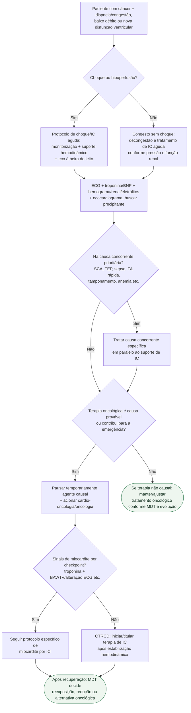

# IC aguda/CTRCD durante terapia oncológica

## Regra prática

No paciente oncológico com IC aguda, **estabilização e etiologia caminham juntas**: trate a síndrome de IC imediatamente, mas não deixe a terapia antineoplásica causal continuar por inércia durante uma emergência cardiovascular.