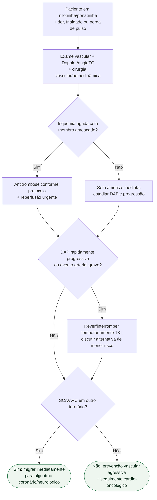

# Isquemia arterial por TKI BCR-ABL

```mermaid
flowchart TD
  R0["Paciente em nilotinibe/ponatinibe<br/>+ dor, frialdade ou perda de pulso"]
  P1["Exame vascular + Doppler/angioTC<br/>+ cirurgia vascular/hemodinâmica"]
  D1{"Isquemia aguda com<br/>membro ameaçado?"}
  P2["Antitrombose conforme protocolo<br/>+ reperfusão urgente"]
  P3["Sem ameaça imediata:<br/>estadiar DAP e progressão"]
  D2{"DAP rapidamente progressiva<br/>ou evento arterial grave?"}
  P4["Rever/interromper temporariamente TKI;<br/>discutir alternativa de menor risco"]
  D3{"SCA/AVC em outro território?"}
  C1(["Sim: migrar imediatamente<br/>para algoritmo coronário/neurológico"])
  C2(["Não: prevenção vascular agressiva<br/>+ seguimento cardio-oncológico"])

  R0 --> P1
  P1 --> D1
  D1 -->|"Sim"| P2
  D1 -->|"Não"| P3
  P2 --> D2
  P3 --> D2
  D2 -->|"Sim"| P4
  D2 -->|"Não"| D3
  P4 --> D3
  D3 -->|"Sim"| C1
  D3 -->|"Não"| C2

  classDef conduta fill:#eef6ef,stroke:#2f7a4f,color:#12301f;
  class C1,C2 conduta;
```

## Regra prática

A toxicidade arterial por TKI é **arterial**, não um subtipo de TEV: examine pulsos, defina viabilidade e reperfunda quando necessário.