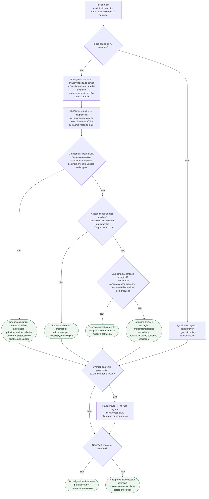

# Isquemia arterial por TKI BCR-ABL

## Regra prática

A toxicidade arterial por TKI é **arterial**, não um subtipo de TEV: defina viabilidade antes de pedir imagem extensa, anticoagule a isquemia aguda quando não houver contraindicação e não reperfunda tecido irreversivelmente inviável. A investigação da causa e a decisão sobre o TKI não podem atrasar terapia salvadora do membro.
