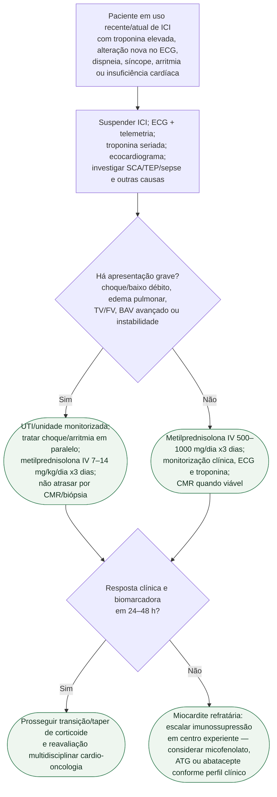

# Miocardite por inibidor de checkpoint imune

## Segurança

FEVE preservada não exclui o diagnóstico. Em miocardite por ICI, bloqueio de condução e arritmia ventricular podem ser a manifestação predominante e justificam monitorização intensiva mesmo antes de disfunção ventricular evidente.
