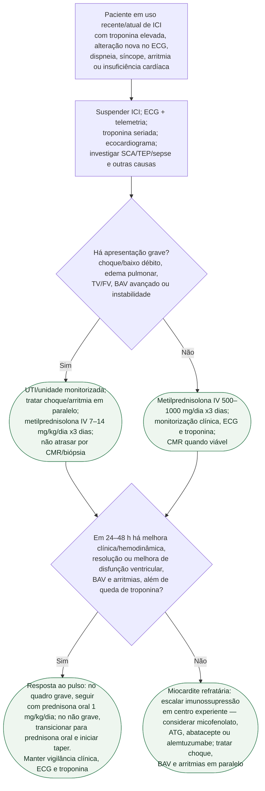

# Miocardite por inibidor de checkpoint imune

## Segurança

FEVE preservada não exclui o diagnóstico. Em miocardite por ICI, bloqueio de condução e arritmia ventricular podem ser a manifestação predominante e justificam monitorização intensiva mesmo antes de disfunção ventricular evidente.

O tratamento não deve aguardar ressonância ou biópsia quando a miocardite é
clinicamente provável. Em contrapartida, troponina isoladamente elevada, sem
sintomas, alteração nova no ECG, disfunção ventricular ou outro dado compatível,
exige investigação de causas alternativas e não confirma por si só miocardite.

A diretriz ESC 2025 enumera opções de segunda linha, mas não estabelece que uma
seja superior às demais. A escolha depende do fenótipo, das toxicidades imunes
concomitantes, de infecção, citopenias e experiência do centro; por isso o fluxo
não atribui uma ordem universal entre micofenolato, ATG, abatacepte e
alemtuzumabe.
