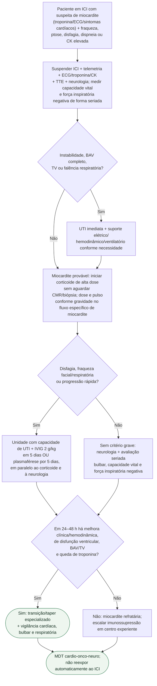

# Overlap por ICI

## Regra prática

No overlap por ICI, **o próximo órgão a falhar pode ser o coração ou a musculatura respiratória**; ambos precisam ser monitorados desde a chegada. O tratamento da miastenia grave não deve aguardar a definição de refratariedade da miocardite. Evitar, quando possível, fármacos que podem piorar a transmissão neuromuscular, como betabloqueadores, magnésio IV, fluoroquinolonas, aminoglicosídeos e macrolídeos; qualquer necessidade crítica deve ser discutida com neurologia e a equipe de emergência.

O detalhamento de dose por gravidade cardíaca e de segunda linha está no [fluxograma de miocardite por ICI](fluxograma-miocardite-por-inibidor-de-checkpoint-imune-emergencia-esc-2025.md), evitando que este fluxo de overlap replique uma sequência divergente.
