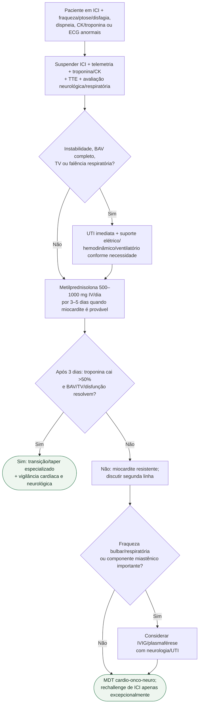

# Overlap por ICI

```mermaid
flowchart TD
  R0["Paciente em ICI + fraqueza/ptose/disfagia,<br/>dispneia, CK/troponina ou ECG anormais"]
  P1["Suspender ICI + telemetria + troponina/CK<br/>+ TTE + avaliação neurológica/respiratória"]
  D1{"Instabilidade, BAV completo,<br/>TV ou falência respiratória?"}
  P2["UTI imediata + suporte elétrico/<br/>hemodinâmico/ventilatório conforme necessidade"]
  P3["Metilprednisolona 500–1000 mg IV/dia<br/>por 3–5 dias quando miocardite é provável"]
  D2{"Após 3 dias: troponina cai >50%<br/>e BAV/TV/disfunção resolvem?"}
  C1(["Sim: transição/taper especializado<br/>+ vigilância cardíaca e neurológica"])
  P4["Não: miocardite resistente;<br/>discutir segunda linha"]
  D3{"Fraqueza bulbar/respiratória<br/>ou componente miastênico importante?"}
  P5["Considerar IVIG/plasmaférese<br/>com neurologia/UTI"]
  C2(["MDT cardio-onco-neuro;<br/>rechallenge de ICI apenas excepcionalmente"])

  R0 --> P1
  P1 --> D1
  D1 -->|"Sim"| P2
  D1 -->|"Não"| P3
  P2 --> P3
  P3 --> D2
  D2 -->|"Sim"| C1
  D2 -->|"Não"| P4
  P4 --> D3
  D3 -->|"Sim"| P5
  D3 -->|"Não"| C2
  P5 --> C2

  classDef conduta fill:#eef6ef,stroke:#2f7a4f,color:#12301f;
  class C1,C2 conduta;
```

## Regra prática

No overlap por ICI, **o próximo órgão a falhar pode ser o coração ou a musculatura respiratória**; ambos precisam ser monitorados desde a chegada.