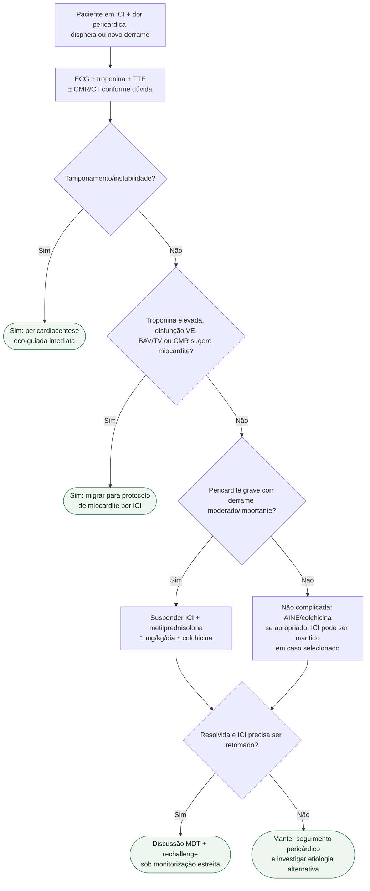

# Pericardite/derrame por ICI

```mermaid
flowchart TD
  R0["Paciente em ICI + dor pericárdica,<br/>dispneia ou novo derrame"]
  P1["ECG + troponina + TTE<br/>± CMR/CT conforme dúvida"]
  D1{"Tamponamento/instabilidade?"}
  C1(["Sim: pericardiocentese<br/>eco-guiada imediata"])
  D2{"Troponina elevada, disfunção VE,<br/>BAV/TV ou CMR sugere miocardite?"}
  C2(["Sim: migrar para protocolo<br/>de miocardite por ICI"])
  D3{"Pericardite grave com<br/>derrame moderado/importante?"}
  P2["Suspender ICI + metilprednisolona<br/>1 mg/kg/dia ± colchicina"]
  P3["Não complicada: AINE/colchicina<br/>se apropriado; ICI pode ser mantido<br/>em caso selecionado"]
  D4{"Resolvida e ICI precisa ser retomado?"}
  C3(["Discussão MDT + rechallenge<br/>sob monitorização estreita"])
  C4(["Manter seguimento pericárdico<br/>e investigar etiologia alternativa"])

  R0 --> P1
  P1 --> D1
  D1 -->|"Sim"| C1
  D1 -->|"Não"| D2
  D2 -->|"Sim"| C2
  D2 -->|"Não"| D3
  D3 -->|"Sim"| P2
  D3 -->|"Não"| P3
  P2 --> D4
  P3 --> D4
  D4 -->|"Sim"| C3
  D4 -->|"Não"| C4

  classDef conduta fill:#eef6ef,stroke:#2f7a4f,color:#12301f;
  class C1,C2,C3,C4 conduta;
```

## Regra prática

No paciente em ICI, **troponina e ecocardiograma decidem se você está diante de pericardite isolada ou de uma emergência miopericárdica**.