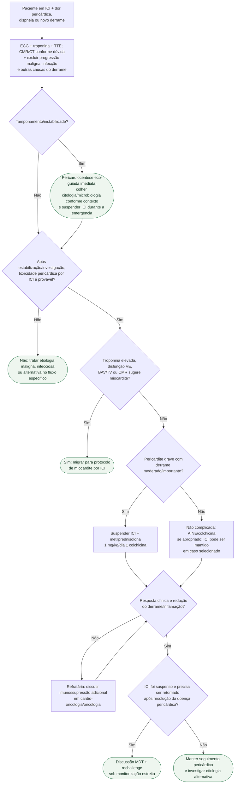

# Pericardite/derrame por ICI

## Regra prática

No paciente em ICI, **troponina e ecocardiograma decidem se você está diante de pericardite isolada ou de uma emergência miopericárdica**.

Se houver suspeita miocárdica, usar o [fluxograma de miocardite por ICI](fluxograma-miocardite-por-inibidor-de-checkpoint-imune-emergencia-esc-2025.md), que contém a estratificação cardíaca e a sequência de imunossupressão.
