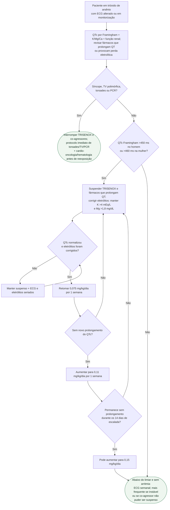

# QT prolongado durante trióxido de arsênio

## Regra prática

Trióxido de arsênio combina **alta frequência de QT prolongado com risco real de arritmia ventricular**. Neste fármaco, não se deve importar o limiar genérico de QTcF ≥500 ms: a bula usa QTc de Framingham >450 ms no homem ou >460 ms na mulher para suspensão e exige retomada escalonada. Arritmia ventricular ou QTc prolongado já presentes antes da dose contraindicam administrar TRISENOX até avaliação e correção.
