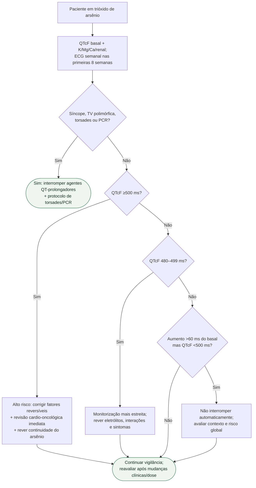

# QT prolongado durante trióxido de arsênio

## Regra prática

Trióxido de arsênio combina **alta frequência de QT prolongado com risco real de arritmia ventricular**; sintomas e QTcF ≥500 ms exigem resposta imediata, não espera pelo próximo ECG programado.