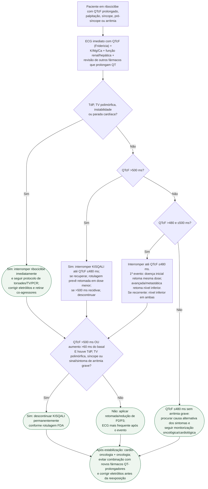

# QT prolongado por ribociclibe — emergência

## Regras regulatórias verificadas

- **QTcF >480 e ≤500 ms:** interromper ribociclibe até QTcF ≤480 ms. Na primeira ocorrência, retomar na mesma dose se doença inicial e no próximo nível inferior se doença avançada/metastática. Se >480 ms recorrer, interromper novamente e retomar no próximo nível inferior em ambas as indicações.
- **QTcF >500 ms:** interromper até QTcF ≤480 ms e, quando a retomada for permitida, reduzir para o próximo nível de dose; se QTcF >500 ms recidivar, descontinuar.
- **Descontinuação permanente:** QTcF >500 ms ou aumento >60 ms do basal associado a torsades de pointes, TV polimórfica, síncope ou sinais/sintomas de arritmia grave.
- **Monitorização regulatória:** ECG antes de iniciar, aproximadamente no dia 14 do primeiro ciclo e conforme indicação clínica; após qualquer prolongamento do QTcF, aumentar a frequência dos ECGs.

## Segurança

A emergência elétrica tem prioridade sobre a decisão oncológica de dose. Se houver torsades/TV polimórfica, o paciente migra imediatamente para o protocolo específico de **torsades de pointes e QT longo adquirido** já existente no Modo Emergência.
