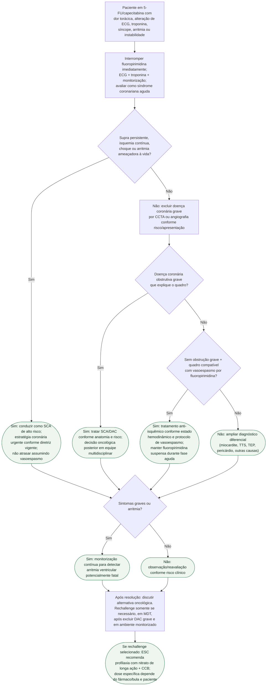

# SCA/vasoespasmo durante 5-FU ou capecitabina

## Regra de segurança

A emergência não é o momento de “testar” se a dor é apenas espasmo: **suspender a fluoropirimidina e excluir SCA/doença coronária grave primeiro**. Reexposição é uma decisão posterior, selecionada e multidisciplinar.
