# SCA no paciente oncológico com trombocitopenia

```mermaid
flowchart TD
  R0["Paciente com câncer + suspeita de SCA<br/>± trombocitopenia"]
  P1["ECG + troponina + monitorização<br/>+ hemograma/plaquetas + eco precoce"]
  D1{"STEMI ou complicação aguda da SCA:<br/>choque, edema pulmonar ou<br/>taquiarritmia ventricular?"}
  P2["Estratégia invasiva imediata/urgente;<br/>o benefício sintomático e vital não depende<br/>de prognóstico oncológico ≥6 meses"]
  D1B{"No NSTE-ACS: prognóstico oncológico<br/>estimado ≥6 meses, ou alto risco/<br/>isquemia persistente?"}
  P3["NSTE-ACS de baixo risco, sem isquemia<br/>persistente nem instabilidade, e prognóstico<br/>oncológico <6 meses: pode-se tentar<br/>estratégia não invasiva"]
  P10["Antes da angiografia, se plaquetas <50.000/µL:<br/>preferir acesso radial, hemostasia cuidadosa<br/>e HNF reduzida a 30-50 U/kg;<br/>se >=50.000/µL, anticoagular conforme protocolo de SCA;<br/>se <20.000/µL, considerar transfusão com hematologia"]
  D2{"Plaquetas ≥30.000/µL?"}
  P4["PCI pode ser realizada se clinicamente<br/>indicada; se CABG for necessária, especialistas<br/>aconselham mínimo de 50.000/µL"]
  P5["Abaixo de 30.000/µL: PCI fica abaixo do<br/>limiar aconselhado por especialistas;<br/>discutir suporte hematológico e risco-benefício<br/>sem atrasar uma decisão vital"]
  D3{"Plaquetas ≥10.000/µL?"}
  P6["AAS não deve ser suspenso apenas pela<br/>contagem se ≥10.000/µL e não houver<br/>outra contraindicação"]
  P7["Plaquetas <10.000/µL: não iniciar/manter AAS<br/>automaticamente; decisão excepcional exige<br/>hematologia, controle do sangramento e<br/>estratégia transfusional quando indicada"]
  D4{"Plaquetas ≥30.000/µL e DAPT indicada?"}
  P8["Preferir AAS + clopidogrel após stent;<br/>manter DAPT tão curta quanto possível,<br/>em geral 1-3 meses"]
  P9["Plaquetas <30.000/µL: não iniciar/manter<br/>clopidogrel automaticamente; individualizar<br/>com cardiologia intervencionista e hematologia"]
  C1(["Revisar terapia oncológica causal<br/>+ decisão cardio-oncológica após estabilização"])

  R0 --> P1
  P1 --> D1
  D1 -->|"Sim"| P2
  D1 -->|"Não"| D1B
  D1B -->|"Sim"| P2
  D1B -->|"Não — baixo risco,<br/>sem isquemia/instabilidade e<br/>prognóstico <6 meses"| P3
  P2 --> P10
  P3 --> D3
  P10 --> D2
  D2 -->|"Sim"| P4
  D2 -->|"Não"| P5
  P4 --> D3
  P5 --> D3
  D3 -->|"Sim"| P6
  D3 -->|"Não"| P7
  P6 --> D4
  P7 --> D4
  D4 -->|"Sim"| P8
  D4 -->|"Não"| P9
  P8 --> C1
  P9 --> C1

  classDef conduta fill:#eef6ef,stroke:#2f7a4f,color:#12301f;
  class P2,P3,P4,P5,P6,P7,P8,P9,C1 conduta;
```

## Regra prática

**Plaquetopenia modifica a estratégia, mas não transforma SCA em contraindicação à reperfusão.** O risco hemorrágico deve ser reduzido sem abandonar tratamento isquêmico potencialmente salvador.

Em contagens abaixo de 50.000/µL, **clopidogrel é preferido a prasugrel ou
ticagrelor**, e inibidores da glicoproteína IIb/IIIa devem ser evitados. Esses
limiares não substituem avaliação de sangramento ativo, lesão intracraniana,
coagulopatia ou tendência da contagem — fatores que podem tornar insegura uma
conduta que seria aceitável pelo número isolado.

As medidas procedimentais em trombocitopenia derivam de série pequena e de
consenso de especialistas citado pela diretriz. A dose reduzida de HNF de
30–50 U/kg se aplica quando as plaquetas estão **abaixo de 50.000/µL**; não deve
ser extrapolada automaticamente ao paciente com contagem maior. O documento não
sustenta tratar 30.000/µL como garantia de segurança; esse valor funciona como
limiar mínimo aconselhado para PCI dentro de uma decisão individual, com
hemostasia e suporte apropriados.
