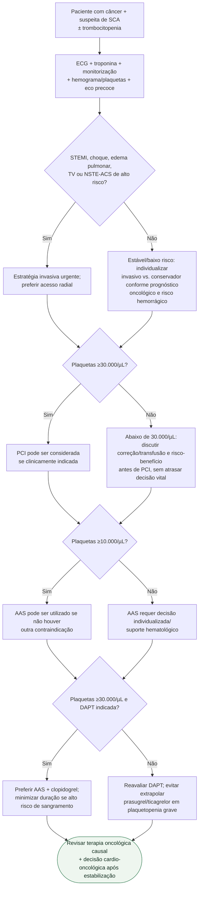

# SCA no paciente oncológico com trombocitopenia

## Regra prática

**Plaquetopenia modifica a estratégia, mas não transforma SCA em contraindicação à reperfusão.** O risco hemorrágico deve ser reduzido sem abandonar tratamento isquêmico potencialmente salvador.