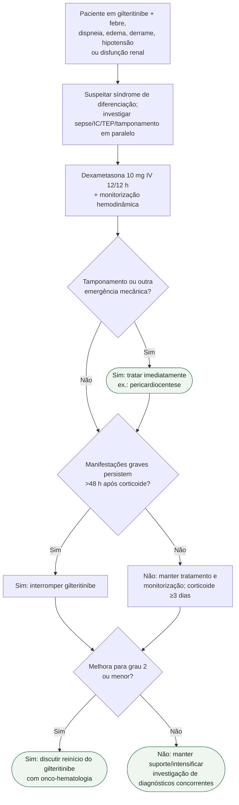

# Síndrome de diferenciação por gilteritinibe

## Regra prática

Síndrome de diferenciação pode coexistir com sepse e insuficiência cardíaca. **Trate primeiro o risco:** corticoide precoce, monitorização e investigação paralela.