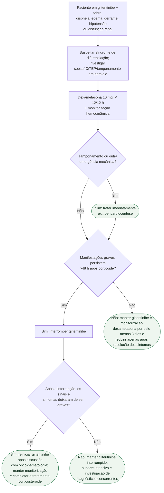

# Síndrome de diferenciação por gilteritinibe

## Regra prática

Síndrome de diferenciação pode coexistir com sepse e insuficiência cardíaca. **Trate primeiro o risco:** corticoide precoce, monitorização e investigação paralela.

O prazo de 48 horas não é uma espera para iniciar tratamento: dexametasona e
monitorização começam assim que a síndrome é suspeitada. Ele define quando a
persistência de manifestações graves passa a exigir a interrupção temporária do
gilteritinibe. Tamponamento, choque, hipoxemia e insuficiência renal recebem suporte
específico em paralelo ao corticoide.
