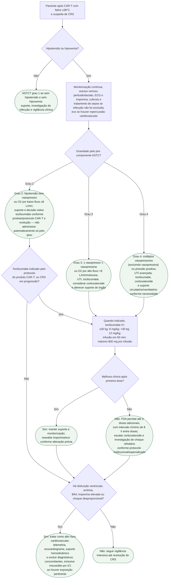

# Síndrome de liberação de citocinas por CAR-T com hipotensão/choque

## Pontos críticos

- A graduação ASTCT é determinada pelo **pior** entre hipotensão e hipoxemia; febre ≥38°C é requisito para o diagnóstico inicial de CRS.
- Tocilizumabe para CRS por CAR-T é administrado **por via intravenosa**. A rotulagem FDA recomenda 8 mg/kg em pacientes ≥30 kg e 12 mg/kg em pacientes <30 kg, com máximo de 800 mg por infusão.
- Se não houver melhora, podem ser administradas até **3 doses adicionais**, com intervalo mínimo de **8 horas**.
- O risco cardiovascular não é teórico: a coorte de Alvi et al. mostrou que eventos cardiovasculares se concentraram nos pacientes com CRS grau ≥2 e eram frequentemente precedidos por elevação de troponina.
- A classificação ASTCT descreve gravidade; ela não determina sozinha quando
  administrar tocilizumabe. No grau 2, a indicação e o limiar de escalada dependem
  do produto CAR-T, do protocolo institucional e da evolução clínica.
- CRS e sepse podem coexistir. Culturas, antimicrobianos quando indicados e busca
  de foco infeccioso não devem ser adiados porque a febre surgiu após CAR-T.
