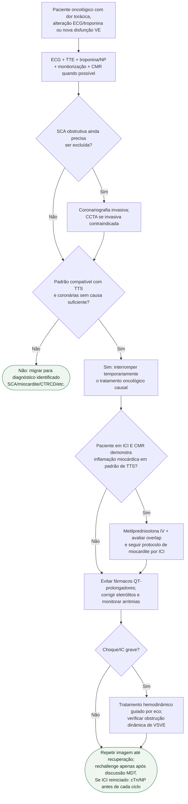

# Takotsubo associado ao câncer

## Regra prática

No câncer, TTS precisa ser separado de **SCA e miocardite por ICI** antes de ser tratado como simples disfunção ventricular por estresse. Se houver nova elevação de troponina ou peptídeo natriurético após reinício do ICI, repetir TTE. Inflamação miocárdica deve seguir o [fluxograma de miocardite por ICI](fluxograma-miocardite-por-inibidor-de-checkpoint-imune-emergencia-esc-2025.md); exposição ao ICI sem inflamação não basta para indicar imunossupressão.
