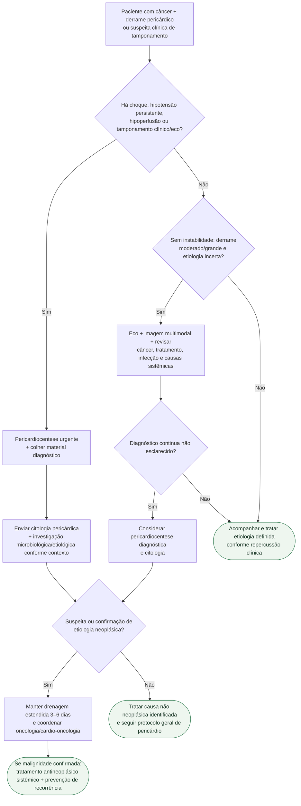

# Tamponamento/derrame pericárdico em paciente com câncer

## Regra prática

No paciente oncológico, **instabilidade decide a urgência; citologia decide parte da etiologia**. Não espere confirmação de malignidade para drenar tamponamento, e não presuma malignidade em todo derrame.