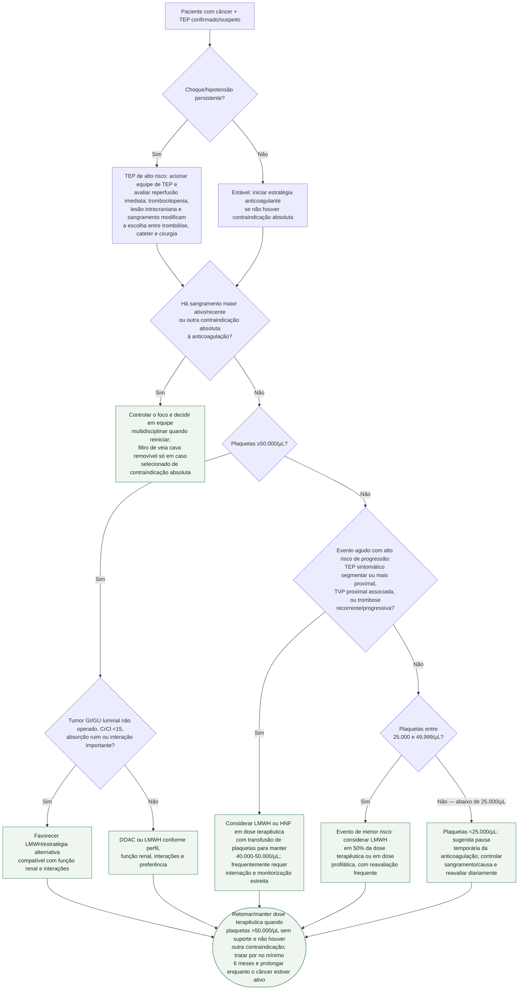

# TEP agudo associado ao câncer

## Regra prática

**Instabilidade hemodinâmica define a urgência da reperfusão; abaixo de 50.000
plaquetas/µL, o risco de progressão do trombo define se a prioridade é sustentar
anticoagulação terapêutica com transfusão ou reduzir/pausar temporariamente.**

O corte de 50.000/µL não significa que todo paciente abaixo dele recebe a mesma
conduta. A SSC/ISTH considera de maior risco o TEP sintomático segmentar ou mais
proximal, a TVP proximal associada e a trombose recorrente/progressiva. TEP
subsegmentar incidental isolado e trombose relacionada a cateter integram o grupo
de menor risco, desde que não haja outro fator de progressão.

## Limites da evidência

Os ajustes de dose e o suporte transfusional em trombocitopenia grave derivam de
guidance da SSC/ISTH apoiado por evidência observacional e consenso especializado;
não foram comparados entre si em ensaio randomizado. A escolha entre LMWH e HNF,
a meta transfusional e o local de cuidado exigem hematologia/oncologia e equipe de
TEP, sobretudo quando trombocitopenia, sangramento e instabilidade coexistem.
