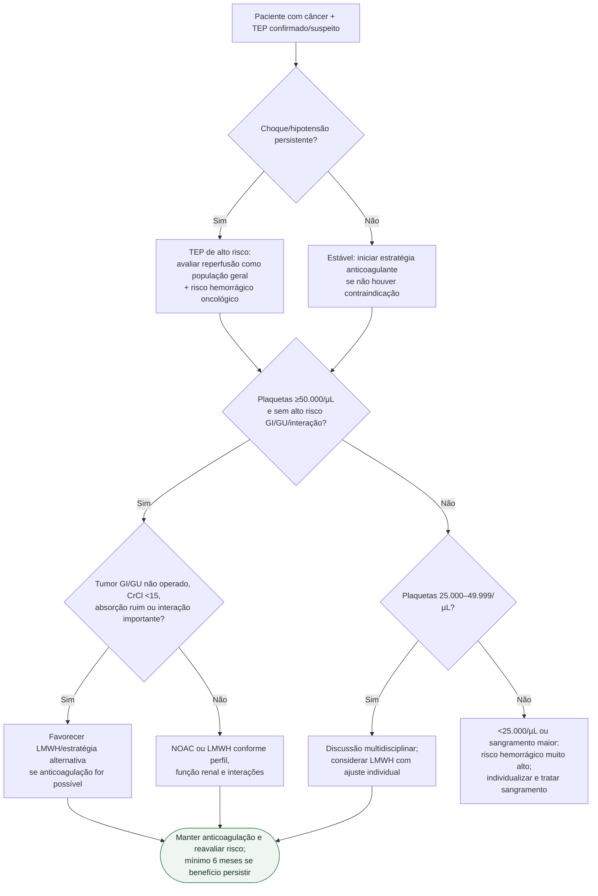

# TEP agudo associado ao câncer

```mermaid
flowchart TD
  R0["Paciente com câncer + TEP confirmado/suspeito"]
  D1{"Choque/hipotensão persistente?"}
  P1["TEP de alto risco:<br/>avaliar reperfusão como população geral<br/>+ risco hemorrágico oncológico"]
  P2["Estável: iniciar estratégia anticoagulante<br/>se não houver contraindicação"]
  D2{"Plaquetas ≥50.000/µL<br/>e sem alto risco GI/GU/interação?"}
  P3["NOAC ou LMWH conforme perfil,<br/>função renal e interações"]
  D3{"Plaquetas 25.000–49.999/µL?"}
  P4["Discussão multidisciplinar;<br/>considerar LMWH com ajuste individual"]
  P5["<25.000/µL ou sangramento maior:<br/>risco hemorrágico muito alto;<br/>individualizar e tratar sangramento"]
  D4{"Tumor GI/GU não operado, CrCl <15,<br/>absorção ruim ou interação importante?"}
  P6["Favorecer LMWH/estratégia alternativa<br/>se anticoagulação for possível"]
  C1(["Manter anticoagulação e reavaliar risco;<br/>mínimo 6 meses se benefício persistir"])

  R0 --> D1
  D1 -->|"Sim"| P1
  D1 -->|"Não"| P2
  P1 --> D2
  P2 --> D2
  D2 -->|"Sim"| D4
  D2 -->|"Não"| D3
  D3 -->|"Sim"| P4
  D3 -->|"Não"| P5
  D4 -->|"Sim"| P6
  D4 -->|"Não"| P3
  P3 --> C1
  P4 --> C1
  P6 --> C1

  classDef conduta fill:#eef6ef,stroke:#2f7a4f,color:#12301f;
  class C1 conduta;
```

## Regra prática

**Plaquetas, sítio tumoral e interações definem a segurança da anticoagulação; instabilidade hemodinâmica define a urgência da reperfusão.**