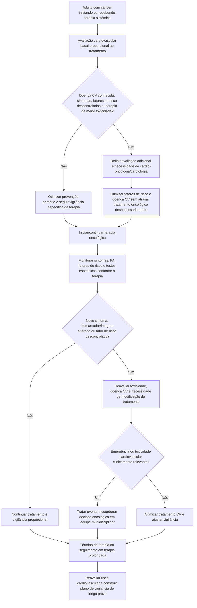

# IC-OS/MASCC 2026 — padrão mínimo de cuidado cardiovascular no adulto com câncer

O statement conjunto da **International Cardio-Oncology Society (IC-OS)** e da **Multinational Association of Supportive Care in Cancer (MASCC)**, publicado em maio de 2026 e posteriormente corrigido, define um padrão mínimo de cuidado cardiovascular ao longo da trajetória oncológica.

A estrutura central do documento é composta por cinco recomendações operacionais:

1. realizar avaliação de risco cardiovascular antes de iniciar terapia sistêmica;
2. identificar e facilitar o cuidado cardiovascular durante o tratamento;
3. mitigar o risco de toxicidade cardiovascular relacionada à terapia antes e durante o tratamento;
4. monitorar status cardiovascular e fatores de risco, encaminhando quando houver descontrole ou novos sinais/sintomas;
5. reavaliar o risco após completar o tratamento e construir um plano de vigilância — periodicamente também para pacientes em terapia prolongada.

## Antes do tratamento oncológico

Avaliar, de forma proporcional ao tratamento planejado:

- história de doença cardiovascular;
- hipertensão, diabetes, dislipidemia, tabagismo e obesidade;
- sintomas cardiovasculares atuais;
- terapias oncológicas prévias cardiotóxicas;
- radioterapia prévia envolvendo coração/mediastino quando relevante;
- terapia planejada e seu perfil de toxicidade;
- necessidade de ECG, biomarcadores e imagem quando indicada pelo tipo de terapia ou risco basal.

## Durante a terapia

A vigilância deve ser **orientada pelo risco e pela toxicidade esperada**, não uma bateria fixa para todos os tumores e fármacos.

Intervenções de alto valor incluem controle ativo de PA, diabetes e lipídios; cessação do tabagismo; atividade física quando possível; reconhecimento precoce de dispneia, dor torácica, síncope, palpitações e edema; e encaminhamento para cardio-oncologia/cardiologia quando o risco ultrapassar a capacidade de manejo do time oncológico.

## Não confundir prevenção com excesso de exames

Em pacientes com câncer metastático recebendo terapia prolongada, existe evidência limitada para realizar exames cardiovasculares rotineiros amplos na ausência de doença cardiovascular, fatores de risco ou exigência específica da terapia. O princípio correto é **monitorização dirigida pelo risco, pelo fármaco e pelo objetivo oncológico**.

## Após o tratamento

Ao término da terapia, ou periodicamente em tratamentos de longa duração:

- reavaliar fatores de risco cardiovascular;
- documentar exposições cardiotóxicas cumulativas relevantes;
- identificar sintomas ou disfunção cardiovascular nova;
- definir plano de vigilância de longo prazo;
- esclarecer quem ficará responsável pela continuidade do cuidado.

## Árvore de decisão — cuidado cardiovascular ao longo do câncer

## Regra prática

**A cardio-oncologia de qualidade começa antes da primeira dose e não termina na última.** Avaliar risco → mitigar fatores modificáveis → monitorar toxicidade de forma dirigida → encaminhar cedo quando necessário → reavaliar e planejar sobrevivência cardiovascular.

## Nota de governança

Cronogramas numéricos específicos de ECG, troponina, BNP/NT-proBNP ou ecocardiograma dependem da classe de terapia e de recomendações específicas. Este documento não inventa um calendário universal onde o statement não o estabelece.