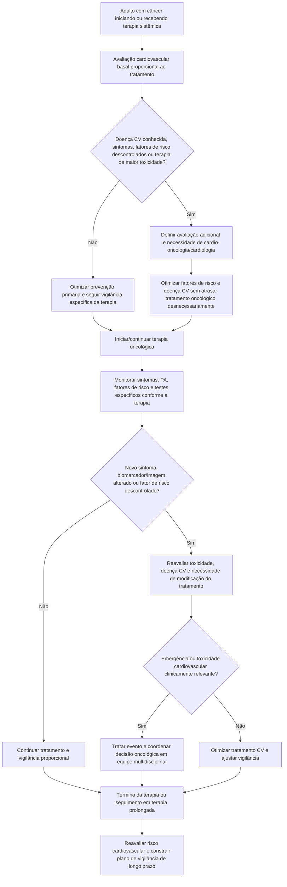

# IC-OS/MASCC 2026 — padrão mínimo de cuidado cardiovascular no adulto com câncer

O statement conjunto da **International Cardio-Oncology Society (IC-OS)** e da **Multinational Association of Supportive Care in Cancer (MASCC)**, publicado em maio de 2026 e posteriormente corrigido em junho de 2026, foi desenhado para responder a uma pergunta prática: qual é o **mínimo de cuidado cardiovascular** que deve acompanhar um adulto com câncer ao longo da trajetória oncológica?

A estrutura central do documento é composta por cinco recomendações amplas e operacionais:

1. realizar avaliação de risco cardiovascular antes de iniciar terapia sistêmica;
2. identificar e facilitar o cuidado cardiovascular durante o tratamento;
3. mitigar o risco de toxicidade cardiovascular relacionada à terapia antes e durante o tratamento;
4. monitorar status cardiovascular e fatores de risco, encaminhando quando houver descontrole ou novos sinais/sintomas;
5. reavaliar o risco após completar o tratamento e construir um plano de vigilância — periodicamente também para pacientes em terapia prolongada ou vitalícia.

## 1. Antes do tratamento oncológico

O objetivo não é pedir ecocardiograma indiscriminadamente para todos, mas reconhecer quem inicia tratamento com risco maior de evento cardiovascular ou de toxicidade específica.

Avaliar, de forma proporcional ao tratamento planejado:

- história de doença cardiovascular;
- hipertensão, diabetes, dislipidemia, tabagismo e obesidade;
- sintomas cardiovasculares atuais;
- terapias oncológicas prévias cardiotóxicas;
- radioterapia prévia envolvendo coração/mediastino quando relevante;
- terapia planejada e seu perfil de toxicidade;
- necessidade de ECG, biomarcadores e imagem quando indicada pelo tipo de terapia ou risco basal.

## 2. Durante a terapia

A vigilância deve ser **orientada pelo risco e pela toxicidade esperada**, não uma bateria fixa para todos os tumores e todos os fármacos.

Intervenções de alto valor incluem:

- controle ativo da pressão arterial;
- tratamento adequado de diabetes e dislipidemia;
- cessação do tabagismo;
- atividade física e estilo de vida quando clinicamente possível;
- reconhecimento precoce de dispneia, dor torácica, síncope, palpitações e edema;
- identificação de novas alterações em ECG, biomarcadores ou imagem quando a terapia exigir vigilância específica;
- encaminhamento para cardio-oncologia/cardiologia quando o risco ultrapassar a capacidade de manejo do time oncológico.

## 3. Não confundir prevenção com excesso de exames

O documento ressalta que a intensidade de investigação precisa fazer sentido clínico. Em pacientes com câncer metastático recebendo terapia prolongada, por exemplo, existe evidência limitada para realizar exames cardiovasculares rotineiros amplos na ausência de doença cardiovascular, fatores de risco ou exigência específica da terapia.

O princípio correto é **monitorização dirigida pelo risco, pelo fármaco e pelo objetivo oncológico**.

## 4. Após o tratamento

Ao término da terapia, ou periodicamente em tratamentos de longa duração:

- reavaliar fatores de risco cardiovascular;
- documentar exposições cardiotóxicas cumulativas relevantes;
- identificar sintomas ou disfunção cardiovascular nova;
- definir plano de vigilância de longo prazo;
- esclarecer quem ficará responsável pela continuidade do cuidado — oncologia, atenção primária, cardiologia ou cardio-oncologia.

## Árvore de decisão — cuidado cardiovascular ao longo do câncer

## Quando encaminhar mais cedo para cardio-oncologia

Encaminhamento precoce é particularmente útil quando há:

- doença cardiovascular estabelecida com terapia potencialmente cardiotóxica;
- sintomas cardiovasculares antes ou durante o tratamento;
- hipertensão ou outros fatores de risco persistentemente não controlados;
- alteração nova de função ventricular, strain, troponina ou ECG quando clinicamente relevante;
- necessidade de decidir entre continuar, pausar, trocar ou reiniciar terapia oncológica por toxicidade cardiovascular;
- múltiplas toxicidades cardiovasculares concorrentes;
- necessidade de decisão compartilhada complexa, como rechallenge após miocardite por ICI.

## Armadilhas

- Pedir eco seriado para qualquer paciente com câncer sem relacionar o exame ao risco ou à terapia.
- Interromper tratamento oncológico apenas por fator de risco cardiovascular controlável.
- Deixar hipertensão, diabetes ou dislipidemia sem tratamento porque o câncer é a prioridade imediata.
- Encerrar a vigilância cardiovascular no dia da última infusão.
- Criar um plano de seguimento sem definir quem será responsável por executá-lo.
- Aplicar cronogramas de monitorização de um agente a outra classe de tratamento sem fonte específica.

## Regra prática

**A cardio-oncologia de qualidade começa antes da primeira dose e não termina na última.** Avaliar risco → mitigar fatores modificáveis → monitorar toxicidade de forma dirigida → encaminhar cedo quando necessário → reavaliar e planejar sobrevivência cardiovascular.

## Nota de governança

Cronogramas numéricos específicos de ECG, troponina, BNP/NT-proBNP ou ecocardiograma dependem da classe de terapia e de recomendações específicas. Este documento não inventa um calendário universal onde o statement não o estabelece.