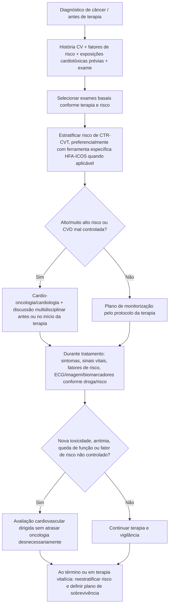
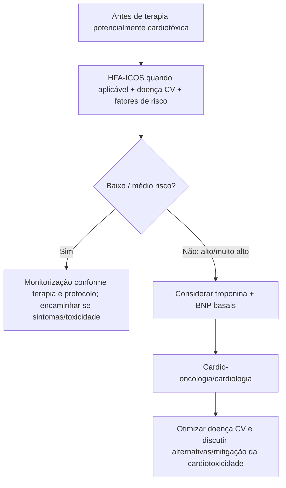
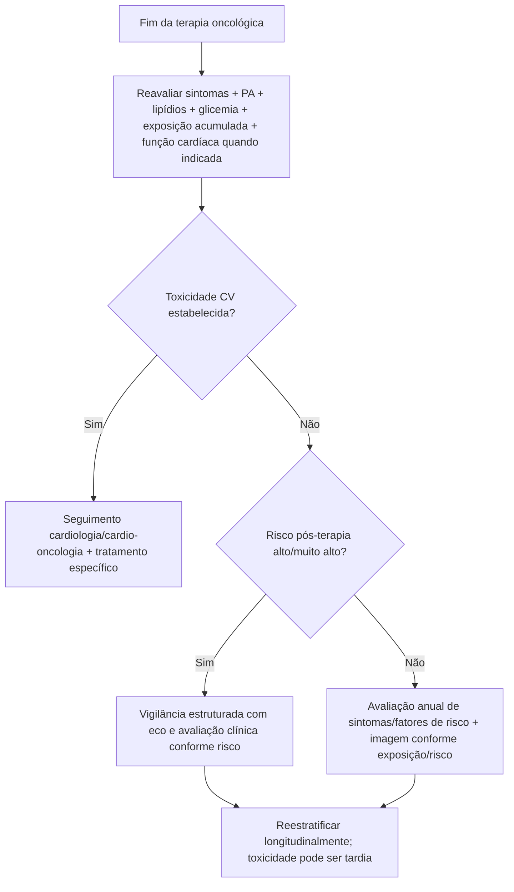

# Cardio-oncologia — padrão mínimo IC-OS/MASCC 2026

## A proposta do documento

O clinical practice statement IC-OS/MASCC de 2026 foi desenhado para responder uma pergunta operacional: **qual é o padrão mínimo de cuidado cardiovascular que todo serviço oncológico deveria conseguir oferecer ou coordenar**, mesmo quando não existe cardio-oncologista disponível localmente?

O consenso organiza cinco comportamentos ao longo de toda a trajetória do câncer:

1. avaliação de risco cardiovascular **antes** da terapia;
2. identificação e coordenação do cuidado CV **durante** o tratamento;
3. medidas de mitigação de cardiotoxicidade antes e durante terapia;
4. monitorização de sintomas e fatores de risco durante tratamento, com encaminhamento quando necessário;
5. reavaliação após o término e criação de plano de vigilância de longo prazo.

## Árvore longitudinal

## Avaliação basal mínima

O consenso recomenda identificar:

- DAC, IC, arritmias e outras doenças CV prévias;
- hipertensão, diabetes, dislipidemia, tabagismo, obesidade e inatividade física;
- radioterapia ou tratamento cardiotóxico prévio;
- pressão arterial, ausculta cardíaca e IMC.

Para pacientes em terapia sistêmica, o documento cita **HbA1c e perfil lipídico** como componentes basais.

### ECG

ECG pré-tratamento é indicado no framework para pacientes com risco/fatores CV prévios e para terapias associadas a arritmia ou cardiotoxicidade relevante.

### Função ventricular

Para fármacos associados a disfunção de VE, a avaliação basal deve incluir função ventricular. **TTE com GLS, quando disponível**, é apresentado como padrão preferido; CMR é alternativa quando o eco é inadequado e MUGA pode ser considerado quando eco não é viável/disponível.

## HFA-ICOS: risco específico de cardio-oncologia

O statement prefere o **HFA-ICOS baseline cardiotoxicity risk assessment** quando aplicável, em vez de depender apenas de escores gerais da população.

No texto de 2026, a estratificação é resumida em:

- baixo risco: **<10%**;
- risco médio: **10%–19%**;
- alto risco: **≥20%** de complicações cardiovasculares.

Pacientes de alto/muito alto risco devem ser considerados para biomarcadores basais (troponina, BNP) e encaminhamento especializado, com discussão risco-benefício da terapia oncológica.

## Árvore de risco basal

## Metas de fatores de risco citadas pelo statement

Como padrão prático de cuidado, o documento cita:

- **HbA1c <7%**;
- **PA <130/80 mmHg**;
- **LDL <70 mg/dL**.

O próprio consenso reconhece que durante tratamento oncológico ativo pode ser necessário balancear a intensidade da otimização com prioridades e tolerabilidade, deixando algumas metas para intensificação após a terapia.

## Mitigação de toxicidade

O documento inclui:

- cessação do tabagismo;
- atividade física regular;
- manejo de peso e dieta cardioprotetora;
- controle de doença CV preexistente;
- menor exposição cardiotóxica efetiva quando oncologicamente possível;
- técnicas de radioterapia que reduzam exposição cardíaca;
- consideração de formulação lipossomal/dexrazoxano em contextos selecionados de antraciclina de alto risco.

Um exemplo numérico citado é exposição cumulativa a doxorrubicina **>250 mg/m² ou equivalente** como cenário de alto risco em que estratégias protetoras podem ser consideradas.

## Durante a terapia: quando encaminhar

O statement sugere encaminhamento quando surgem, entre outros:

- nova doença cardiovascular;
- queda de função ventricular;
- nova arritmia, como FA;
- hipertensão/fatores de risco persistentemente mal controlados;
- interação farmacológica relevante;
- sintomas cardiovasculares novos.

Como exemplos de alteração de função que exigem atenção, cita **FEVE <53% e/ou queda de GLS >15%**, porém essas métricas devem ser interpretadas conforme a definição de CTR-CVT e o protocolo da terapia específica.

## Após tratamento: sobrevivência é fase cardiovascular ativa

Todos os sobreviventes devem receber:

- educação sobre toxicidade tardia;
- aconselhamento de estilo de vida;
- reavaliação de risco cardiovascular após a última terapia;
- avaliação anual de sintomas e fatores de risco;
- encaminhamento se sintomas cardiovasculares surgirem a qualquer momento.

### Vigilância ecocardiográfica citada

- Eco em **12 meses** após HER2-targeted therapy ou doxorrubicina cumulativa ≥250 mg/m²/equivalente em cenários descritos pelo documento.
- Risco moderado: eco a cada **5 anos pode ser considerado** (IIb C, conforme a fonte ESC incorporada).
- Alto/muito alto risco: eco nos anos **1, 3 e 5** e depois a cada 5 anos, com individualização (IIa C, conforme fonte incorporada).
- Reestratificação de risco cardiovascular após **5 anos**.

## Árvore de sobrevivência

## Armadilhas

1. Não limitar cardio-oncologia ao momento em que a FEVE cai.
2. Não começar terapia cardiotóxica sem registrar risco basal mínimo.
3. Não aplicar indiscriminadamente um mesmo calendário de eco a todas as drogas.
4. Não abandonar vigilância depois que o câncer entrou em remissão.
5. Não usar risco cardiovascular para negar terapia oncológica potencialmente curativa sem discussão multidisciplinar de alternativas e mitigação.

## Fonte verificada

Dent S, Nadler MB, Blaes A, et al. Prevention and management of cardiovascular disease in adults with cancer: an International Cardio-Oncology Society (IC-OS) and Multinational Association of Supportive Care in Cancer (MASCC) clinical practice statement. *Support Care Cancer.* 2026;34(6):590. PMID **42209784**. PMCID **PMC13219080**. DOI **10.1007/s00520-026-10741-8**.

Correção publicada em 30/06/2026: DOI **10.1007/s00520-026-10950-1**, PMID **42377594**.

## Status de revisão

`VERIFICAÇÃO HUMANA NECESSÁRIA`: os calendários de imagem e thresholds de CTR-CVT devem ser reconciliados com o protocolo específico da terapia e com a diretriz institucional antes de automação assistencial.
