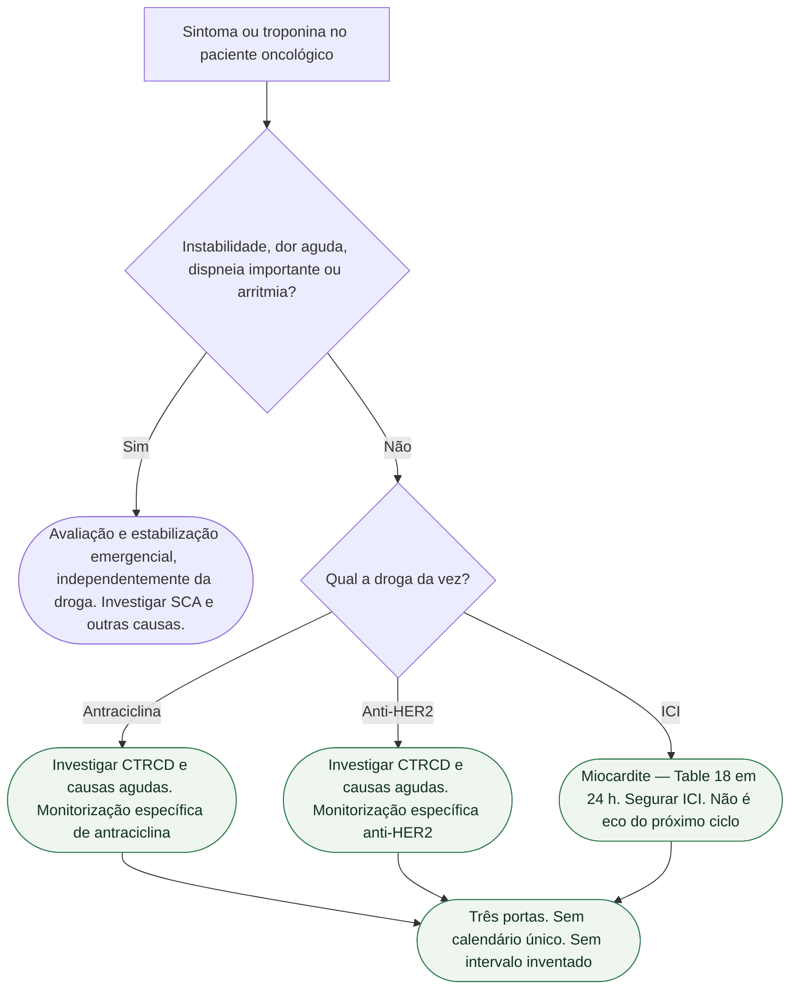

# Miocardite por ICI não é antraciclina

Três portas. Três toxicidades. **Não há um calendário só.** A ficha-irmã [HER2 não é antraciclina: duas portas de monitoramento](/biblioteca/her2-nao-e-antraciclina-duas-portas-de-monitoramento) já fechou Table 7 ≠ Table 8. Esta fecha a terceira: **miocardite por inibidor de checkpoint (ICI) não herda o calendário da antraciclina nem o do trastuzumabe.**

**Fontes:** Lyon AR et al. *Eur Heart J*. 2022;**43**(41):4229-4361. DOI 10.1093/eurheartj/ehac244. PMID **36017568**. PubMed **sem abstract**. Keywords do próprio PubMed: **Anthracycline**; **Immunotherapy**; **Myocarditis**; **Echocardiography** — quatro entradas, não uma. Schulz-Menger J, Imazio M et al. *Eur Heart J*. 2025;**46**(40):3952-4041. DOI 10.1093/eurheartj/ehaf192. PMID **40878297**. PubMed **sem abstract**. A Table 18 (emergência ICI) já está em [Miocardite por inibidor de checkpoint — ESC 2025, Tabela 18](/biblioteca/miocardite-por-inibidor-de-checkpoint-esc-2025). **Não se republica aqui.** Intervalos de eco: **não inventados.**

## Três portas, três perguntas

Não ler a linha de baixo como “correção” da de cima. Cada linha é uma pergunta. Classes de monitorização **durante** a droga **não** saem do abstract do PubMed — **não** se cola “a cada dois ciclos” em ninguém.

| Porta | O que é | O que não é | Onde já está neste lote |
|---|---|---|---|
| **Antraciclina** | CTRCD dose-cumulativa, pode ser tardia. Eco **basal** em **todos** **antes** da droga — **I B** (Table 7, ficha-irmã). | Não é miocardite fulminante de ICI. Não é Table 8. | [Antraciclina: o que a ESC 2022 ainda manda fazer antes da droga](/biblioteca/antraciclina-o-que-a-esc-2022-ainda-manda-fazer-antes-da-droga) |
| **HER2** | Outra tabela (Table 8). Outra toxicidade. Eco basal **antes** do anti-HER2 — **I B**. Continuar trastuzumabe na CTRCD assintomática moderada é frase da **porta HER2**. | Não é antraciclina. Não é Table 18. | [HER2 não é antraciclina: duas portas de monitoramento](/biblioteca/her2-nao-e-antraciclina-duas-portas-de-monitoramento) |
| **ICI** | Miocardite inflamatória. Emergência. Triagem em **24 h**, **segurar o ICI**, corticoide em alta dose — Table 18 da ESC 2025. | Não é o eco do terceiro ciclo. Não é CTRCD da antraciclina. Não é “marcar strain na semana que vem”. | [Miocardite por inibidor de checkpoint — ESC 2025, Tabela 18](/biblioteca/miocardite-por-inibidor-de-checkpoint-esc-2025) |

HFA-ICOS **IIa C** e ECG **I C** valem **antes** de terapia cardiotóxica — Table 1 da 2022, já aberta nas fichas-irmãs. Isso **não** unifica o calendário depois da primeira dose. A coluna do ICI **não** é a coluna da antraciclina. A coluna do HER2 **também não**.

## O que a 2022 indexa — e o que o PubMed não entrega

PMID **36017568**: primeira diretriz ESC de cardio-oncologia. Colaboração EHA, ESTRO e IC-OS. *Eur Heart J*. 2022;**43**:4229-4361. Errata PMID **36952225**. O PubMed desta diretriz **não tem abstract**. O índice de palavras-chave **separa** antraciclina, imunoterapia e miocardite. As recomendações específicas de cada classe de tratamento sustentam a distinção clínica. **Não** autoriza transcrever intervalo de eco, miligrama de corticoide nem mortalidade percentual.

O mapa 2022+2025 já existe: [ESC 2022 de cardio-oncologia: o que ainda vale junto da miocardite 2025](/biblioteca/esc-2022-cardio-oncologia-o-que-ainda-vale-junto-da-miocardite-2025). A 2025 **não** aposenta a 2022. A 2022 **não** transforma ICI em “mais um esquema de eco”.

## O que a 2025 manda na porta ICI — sem copiar a tabela

PMID **40878297**. Table 18: **quatro** linhas, já extraídas na ficha de emergência. Aqui só o recado de calendário:

1. Suspeita de miocardite por ICI **não espera** o próximo ciclo de vigilância da antraciclina.
2. **24 horas** é triagem diagnóstica — **I C**. Não é “eco em 3 meses”.
3. **Interromper o ICI** e corticoide em alta dose — **I C**. Não é “iniciar IECA e repetir GLS”.
4. Segunda linha (esteroide-refratária / fulminante) mora na Table 18 (**IIa C** / **IIb C**) e na posologia da Table 12. **Miligramas não se copiam nesta ficha.**

## O que não herda

## Frase da consulta

> “Antraciclina, HER2 e inibidor de checkpoint não estão no mesmo calendário. Queda lenta de FEVE no trastuzumabe não é miocardite de ICI. Troponina no ICI não espera o eco do terceiro ciclo da doxorrubicina.”

Não diga “é cardiotoxicidade, marca eco”. Não prometa que o basal da 2022 cobre a emergência da 2025. Não invente intervalo. Não funda Table 7, Table 8 e Table 18 na mesma frase.

## Tudo com Tudo

- **Cardio-oncologia.** Esta porta: ICI ≠ antraciclina. Irmãs: [HER2 não é antraciclina: duas portas de monitoramento](/biblioteca/her2-nao-e-antraciclina-duas-portas-de-monitoramento); [Antraciclina: o que a ESC 2022 ainda manda fazer antes da droga](/biblioteca/antraciclina-o-que-a-esc-2022-ainda-manda-fazer-antes-da-droga); [Miocardite por inibidor de checkpoint — ESC 2025, Tabela 18](/biblioteca/miocardite-por-inibidor-de-checkpoint-esc-2025); [ESC 2022 de cardio-oncologia: o que ainda vale junto da miocardite 2025](/biblioteca/esc-2022-cardio-oncologia-o-que-ainda-vale-junto-da-miocardite-2025).
- **Cardiomiopatias.** Diagnóstico de miocardite (RMC, BEM) é [ESC 2025: miocardite — diagnóstico, RMC e quando biopsiar](/biblioteca/esc-2025-miocardite-diagnostico-e-quando-biopsia). ICI grave frequentemente é alto risco — a Table 6 não some, e **não** substitui a Table 18.
- **Pericárdio.** Pericardite recorrente (colchicina, anti-IL-1) **não** é miocardite por ICI.
- **Terapia intensiva.** Bloqueio, TV, choque: a porta ICI é conjunta com a UTI. Não esperar o calendário de eco.
- **Insuficiência cardíaca.** CTRCD estabelecida segue GDMT. Miocardite por ICI com disfunção **também** — sem transformar GDMT em substituto de corticoide.
- **Farmacologia.** Antraciclina ≠ HER2 ≠ ICI. Três moléculas, três tabelas.
- **Comunicação clínica.** Uma frase, uma porta. “Cardiotóxico” sem nomear a droga é slogan.
- **Reabilitação cardíaca.** Seção 5.8 da ESC 2026: depois. Não substitui HFA-ICOS antes nem a Table 18 na emergência.

### Leituras conectadas

- [Antraciclina: o que a ESC 2022 ainda manda fazer antes da droga](/biblioteca/antraciclina-o-que-a-esc-2022-ainda-manda-fazer-antes-da-droga)
- [HER2 não é antraciclina: duas portas de monitoramento](/biblioteca/her2-nao-e-antraciclina-duas-portas-de-monitoramento)
- [Miocardite por inibidor de checkpoint — ESC 2025, Tabela 18](/biblioteca/miocardite-por-inibidor-de-checkpoint-esc-2025)
