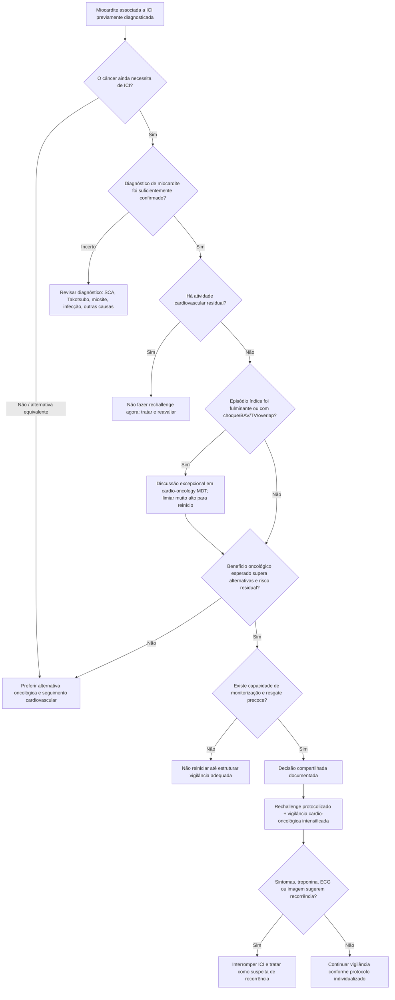

# Rechallenge de ICI após miocardite

O reinício de um **inibidor de checkpoint imune (ICI)** após miocardite não deve ser tratado como uma decisão binária automática. O primer de Salem et al., publicado em 2026, organiza a decisão como um processo de seleção altamente individualizado: a evidência permanece limitada, mas já é suficiente para deslocar a discussão de uma contraindicação absolutamente rígida para uma estratégia excepcional, protocolizada e multidisciplinar em pacientes cuidadosamente selecionados.

A regra central é que o possível benefício oncológico precisa ser clinicamente relevante e superar alternativas disponíveis, enquanto o risco cardiovascular residual precisa ser aceitável e monitorável.

## Quem NÃO deve ser conduzido diretamente a rechallenge

Antes de qualquer discussão de reinício, interromper a lógica de rechallenge e reavaliar se houver:

- miocardite ainda ativa ou certeza insuficiente de resolução;
- troponina persistentemente elevada sem explicação alternativa definida;
- disfunção ventricular nova ainda não recuperada;
- bloqueio atrioventricular, arritmia ventricular ou instabilidade elétrica persistente;
- insuficiência cardíaca ou choque ainda ativos;
- necessidade atual de imunossupressão intensiva;
- alternativa oncológica eficaz com risco cardiovascular substancialmente menor;
- incapacidade de oferecer monitorização cardio-oncológica próxima ou resgate emergencial.

## Cinco domínios da decisão

### 1. Necessidade oncológica

O primer de 2026 recomenda começar pela pergunta oncológica, e não pelo ECG: **o reinício do ICI oferece benefício anticâncer significativo que não pode ser obtido adequadamente por outra estratégia?**

Considerar:

- resposta prévia ao ICI;
- agressividade e estágio do tumor;
- alternativas terapêuticas;
- benefício esperado do rechallenge;
- prognóstico oncológico;
- preferências e tolerância ao risco do paciente.

### 2. Certeza do diagnóstico original

Revisar se o evento realmente foi miocardite por ICI. Diagnósticos alternativos podem alterar radicalmente a estimativa de recorrência:

- síndrome coronariana aguda;
- Takotsubo;
- miocardite infecciosa;
- arritmia ou IC por outra causa;
- miosite com elevação de troponina T sem envolvimento miocárdico comprovado.

### 3. Gravidade do episódio índice

Eventos com choque, arritmia ventricular, BAV avançado, disfunção ventricular importante ou overlap com miosite/miastenia representam um fenótipo de maior preocupação. Não existe, no primer, uma pontuação validada que converta esses achados em probabilidade individual de recorrência.

**Probabilidade numérica de recorrência por subtipo clínico: VERIFICAÇÃO HUMANA NECESSÁRIA.**

### 4. Recuperação cardiovascular

Antes de considerar reinício, documentar recuperação clínica e objetiva com a combinação apropriada de:

- sintomas;
- ECG e condução;
- troponina;
- função ventricular por ecocardiografia;
- CMR quando necessária para esclarecer atividade inflamatória residual;
- ausência de arritmia clinicamente relevante.

O primer não estabelece um único valor universal de troponina, strain, FEVE ou realce tardio que autorize rechallenge isoladamente.

### 5. Capacidade de vigilância e resgate

A decisão só é defensável quando existe estrutura para detectar recorrência cedo e agir rapidamente. O seguimento deve ser definido pelo cardio-oncology team e pode incluir avaliação clínica, ECG, troponina e imagem de acordo com o risco e a terapia.

**Frequência universal de troponina/ECG após cada ciclo no rechallenge: VERIFICAÇÃO HUMANA NECESSÁRIA.** O primer propõe vigilância protocolizada, mas a intensidade deve ser individualizada.

## Árvore de decisão — rechallenge após miocardite por ICI

## Como documentar a decisão

O prontuário deve registrar explicitamente:

1. benefício oncológico esperado;
2. alternativas disponíveis e por que foram consideradas inferiores/inadequadas;
3. gravidade e grau de recuperação do episódio de miocardite;
4. riscos discutidos com o paciente;
5. estratégia de monitorização;
6. plano de interrupção/resgate se houver suspeita de recorrência.

## Armadilhas

- Reiniciar ICI apenas porque a FEVE voltou ao normal.
- Exigir uma CMR completamente normal como critério universal: não existe regra única validada.
- Tratar todo episódio histórico rotulado como “miocardite” como diagnóstico definitivo sem revisar a certeza original.
- Usar ausência de sintomas como sinônimo de resolução inflamatória.
- Fazer rechallenge em ambiente sem acesso rápido a cardiologia, troponina, ECG e manejo de emergência.
- Ignorar a preferência do paciente em uma decisão cujo balanço benefício-risco é altamente sensível a valores individuais.

## Regra prática

**Rechallenge após miocardite por ICI não é rotina; é uma exceção multidisciplinar.** A sequência correta é: necessidade oncológica real → confirmar diagnóstico e recuperação → estratificar gravidade → garantir vigilância/resgate → decisão compartilhada → monitorização protocolizada.