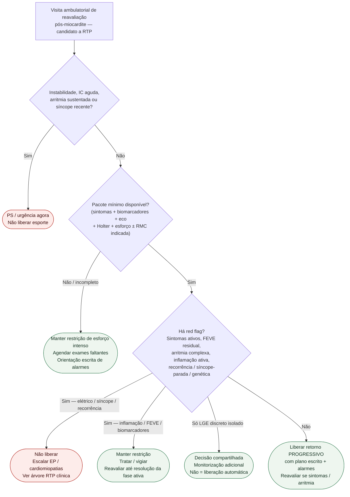

# Fluxograma ambulatorial: gate de liberação pós-miocardite no atleta

Prosa: [`gate-ambulatorial-liberacao-retorno-pos-miocardite-no-atleta`](gate-ambulatorial-liberacao-retorno-pos-miocardite-no-atleta.md). Braço exames: [`exames-pendentes-antes-da-liberacao-pos-miocardite-ambulatorial`](exames-pendentes-antes-da-liberacao-pos-miocardite-ambulatorial.md). Critérios clínicos detalhados: [`fluxograma-miocardite-retorno-esporte-atleta`](fluxograma-miocardite-retorno-esporte-atleta.md).

Não duplica: [`fluxograma-ambulatorial-sinalizadores-atleta-destino`](fluxograma-ambulatorial-sinalizadores-atleta-destino.md) (#848) nem [`fluxograma-ambulatorial-hipertensao-atleta-destino`](fluxograma-ambulatorial-hipertensao-atleta-destino.md) (#877).

## Árvore de decisão

## Notas

- **D1** = gate de segurança (não é visita de liberação se há urgência).
- **D2** = exames incompletos bloqueiam liberação (ACC ECDP / AHA/ACC 2025).
- **D3** = red flags clínicos já detalhados nos fluxogramas RTP revisados; este fluxograma só roteia destino ambulatorial.
- Retorno é sempre **progressivo**, nunca “volta amanhã à final”.
- Não decide doses, WADA, nem elegibilidade por calendário isolado.
