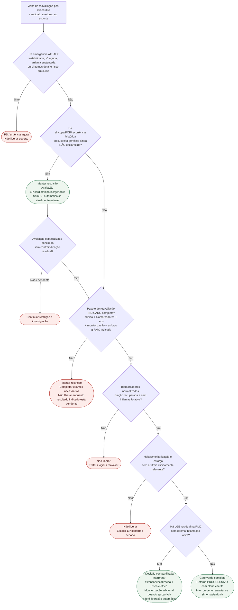

# Fluxograma ambulatorial: gate de liberação pós-miocardite no atleta

Prosa: [`gate-ambulatorial-liberacao-retorno-pos-miocardite-no-atleta`](gate-ambulatorial-liberacao-retorno-pos-miocardite-no-atleta.md). Exames: [`exames-pendentes-antes-da-liberacao-pos-miocardite-ambulatorial`](exames-pendentes-antes-da-liberacao-pos-miocardite-ambulatorial.md). Critérios clínicos detalhados: [`fluxograma-miocardite-retorno-esporte-atleta`](fluxograma-miocardite-retorno-esporte-atleta.md).

## Árvore de decisão

## Notas

- **D1** pergunta por emergência atual; síncope histórica estável não é, sozinha, motivo para PS imediato.
- **D1B/D1C** permitem que fatores históricos reentrem no gate após investigação especializada satisfatória, em vez de funcionarem como bloqueio vitalício.
- **D2**: se uma RMC foi considerada indicada para fechar a decisão, o laudo deve estar disponível e revisado antes da liberação.
- **D3**: biomarcador relevante ainda elevado, mesmo em queda, não cumpre gate verde.
- **D5** impede que LGE residual isolado seja confundido com “sem red flag” e levado diretamente à liberação.
- O backend converte links Markdown relativos canônicos para rotas `/biblioteca/<slug>`; referências a documentos ainda ausentes foram deliberadamente removidas.
