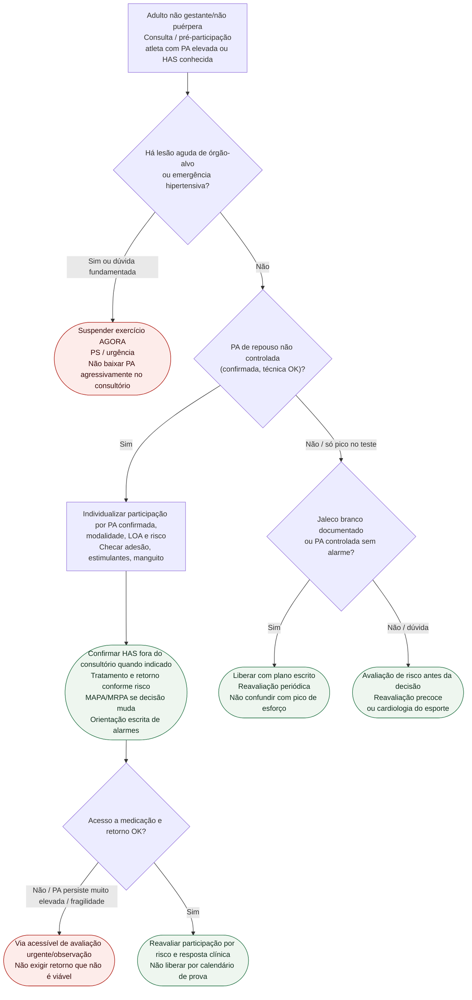

# Fluxograma ambulatorial: hipertensão no atleta — destino

Prosa: [`sinalizadores-ambulatoriais-hipertensao-no-atleta-quando-restringir-e-escalar`](/biblioteca/sinalizadores-ambulatoriais-hipertensao-no-atleta-quando-restringir-e-escalar). Braço PA não controlada: [`pa-nao-controlada-no-atleta-ambulatorial-destino-esporte`](/biblioteca/pa-nao-controlada-no-atleta-ambulatorial-destino-esporte). Fundo: [`hipertensao-arterial-no-atleta-diagnostico-manejo-e-elegibilidade-esportiva`](/biblioteca/hipertensao-arterial-no-atleta-diagnostico-manejo-e-elegibilidade-esportiva).

## Árvore de decisão

## Notas

- **D1** = gate de segurança (AHA/ACC 2025: emergência hipertensiva restringe até estabilização).
- **D2** = PA de repouso não controlada → restrição competitiva temporária (EAPC 2019 / ESC sports 2020).
- **D3** = liberação só com ausência convincente de red flags e controle/fenótipo claro.
- Pico isolado no esforço: não decidir elegibilidade só aqui — ver `resposta-pressorica-exagerada-exercicio-atleta`.
- Não decide doses, WADA, nem elegibilidade definitiva por doença estrutural.

## Escopo e participação

Aplicável a adultos não gestantes/não puérperas. Gestação/puerpério e atletas pediátricos seguem protocolos próprios. Excluir lesão aguda com história, exame e testes dirigidos, não apenas checklist negativo. Sem emergência, confirmar técnica/manguito e MAPA/MRPA antes de diagnosticar HAS por medida isolada; jaleco branco não exige medicação automaticamente. AHA/ACC 2025 permite participação individualizada em estágio 1/2 sem lesão aguda; considerar intensidade/componente estático, PA muito elevada confirmada, LOA e comorbidades. Exercício leve/moderado pode ter decisão diferente de competição intensa. Emergência exige parar e encaminhar; número isolado assintomático não é PS por definição.

Rever pré-treinos/estimulantes, AINE, descongestionantes, anabolizantes/SARMs sem atribuição causal automática. Resposta exagerada ao esforço não equivale a HAS de repouso. Conferir [lista antidoping vigente e TUE](https://www.wada-ama.org/en/prohibited-list) sem atrasar tratamento necessário.
