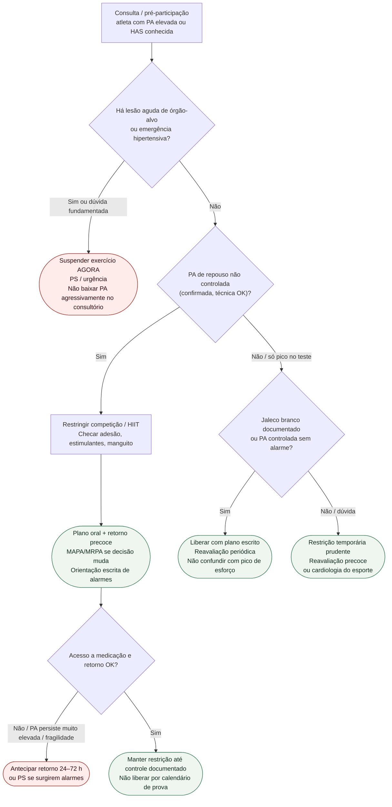

# Fluxograma ambulatorial: hipertensão no atleta — destino

Prosa: [`sinalizadores-ambulatoriais-hipertensao-no-atleta-quando-restringir-e-escalar`](sinalizadores-ambulatoriais-hipertensao-no-atleta-quando-restringir-e-escalar.md). Braço PA não controlada: [`pa-nao-controlada-no-atleta-ambulatorial-destino-esporte`](pa-nao-controlada-no-atleta-ambulatorial-destino-esporte.md). Fundo: [`hipertensao-arterial-no-atleta-diagnostico-manejo-e-elegibilidade-esportiva`](hipertensao-arterial-no-atleta-diagnostico-manejo-e-elegibilidade-esportiva.md).

Não duplica: [`fluxograma-ambulatorial-sinalizadores-atleta-destino`](fluxograma-ambulatorial-sinalizadores-atleta-destino.md) (#848).

## Árvore de decisão

## Notas

- **D1** = gate de segurança (AHA/ACC 2025: emergência hipertensiva restringe até estabilização).
- **D2** = PA de repouso não controlada → restrição competitiva temporária (EAPC 2019 / ESC sports 2020).
- **D3** = liberação só com ausência convincente de red flags e controle/fenótipo claro.
- Pico isolado no esforço: não decidir elegibilidade só aqui — ver `resposta-pressorica-exagerada-exercicio-atleta`.
- Não decide doses, WADA, nem elegibilidade definitiva por doença estrutural.
