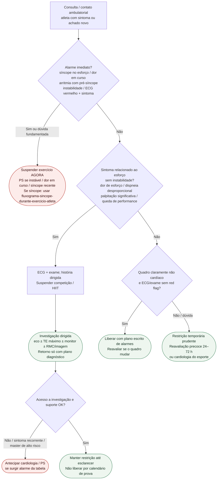

# Fluxograma ambulatorial: sinalizadores no atleta — destino

Prosa: [`sinalizadores-ambulatoriais-no-atleta-quando-suspender-e-encaminhar`](sinalizadores-ambulatoriais-no-atleta-quando-suspender-e-encaminhar.md). Dor torácica: [`dor-toracica-no-atleta-ambulatorial-quando-escalar`](dor-toracica-no-atleta-ambulatorial-quando-escalar.md). Síncope (não duplicar): [`fluxograma-sincope-durante-exercicio-atleta`](fluxograma-sincope-durante-exercicio-atleta.md).

## Árvore de decisão

## Notas

- **D1** = gate de segurança (ESC sports 2020 / AHA/ACC 2025 / HRS 2024).
- **D2** = sintoma de esforço sem instabilidade → restrição + investigação (não “treinar até o exame”).
- **D3** = liberação só com ausência convincente de red flags.
- Síncope no esforço: **não** decidir neste fluxograma — ir ao pacote já publicado.
- Não decide doses, elegibilidade definitiva por doença estrutural nem protocolo de SCA.
