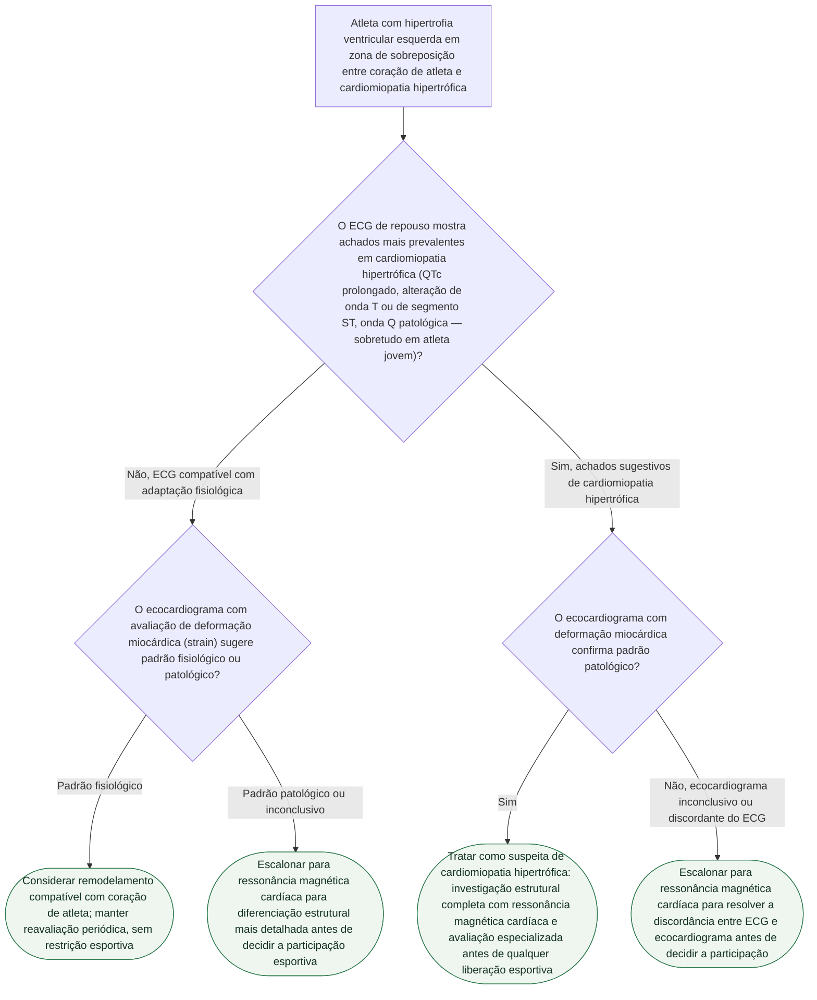

# Coração de atleta versus cardiomiopatia hipertrófica: diferenciação na zona cinzenta

## Árvore de decisão

## Critérios usados na árvore

O documento de origem reúne três fontes (Pagourelias et al., *Heart Fail Rev*. 2025, PMID 40576890; Wiradinata et al., *Eur J Pediatr*. 2025, PMID 41313487; Deligiannis et al., *Hellenic J Cardiol*. 2026, PMID 42142808) e conclui que **nenhuma das três propõe um critério único e definitivo**. O padrão que emerge de forma consistente entre elas é uma abordagem **multimodal e hierárquica**: ECG de repouso como primeira triagem, seguido de imagem cardíaca estruturada (ecocardiografia com deformação miocárdica, escalando para ressonância magnética cardíaca quando a dúvida persistir).

Os achados eletrocardiográficos usados na árvore vêm da metanálise pediátrica de Wiradinata et al. (25 estudos), que encontrou diferenças significativas — mais prevalentes no grupo com cardiomiopatia hipertrófica do que na adaptação fisiológica do atleta jovem — em **prolongamento do intervalo QTc**, **alterações de onda T e do segmento ST** e **ondas Q patológicas** (achados complementares, de estudos de braço único, também apontaram diferença em desvio de eixo, aumento atrial e bloqueios de ramo). A própria metanálise recomenda que uma alteração de ECG detectada deve **motivar investigação adicional**, nunca servir como critério diagnóstico definitivo isolado — por isso a árvore nunca resolve o caso só pelo ECG, sempre escalando para imagem.

A escolha de escalonar para ecocardiografia com avaliação de deformação miocárdica (strain), com possível escalonamento adicional para ressonância magnética cardíaca, segue o guia de imagem multimodal de Pagourelias et al., que descreve a imagem cardiovascular como processo central para diferenciar fenótipos normais de anormais na zona cinzenta.

**Não foram usados cortes numéricos de espessura parietal, diâmetro de câmara ou função diastólica** nesta árvore, porque o próprio documento de origem registra que esses limiares específicos, citados no guia de Pagourelias et al., não estão detalhados no resumo indexado da fonte e exigem **verificação humana** contra o texto completo antes de aplicação clínica — incluí-los aqui seria fabricar um dado que a fonte primária publicada no acervo explicitamente não fornece. A inteligência artificial, mencionada na terceira fonte (Deligiannis et al.) como ferramenta emergente com apenas 1 de 8 estudos comparando diretamente contra coração de atleta (AUC 0,93), não entrou na árvore por ainda não ser considerada validada especificamente para esta população pela própria fonte.