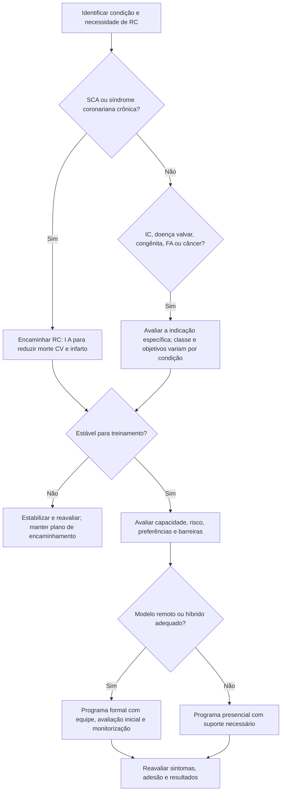

# Fluxograma: encaminhamento para reabilitação cardíaca — ESC2026

O encaminhamento inicia a avaliação; não é liberação automática para exercício. O programa combina treino individualizado, educação, controle de fatores de risco, tratamento clínico e suporte psicossocial.

Na ICFEp, RC é I B1 para capacidade física e qualidade de vida e IIa B1 para reduzir hospitalizações por qualquer causa. Após cirurgia/TAVI por estenose aórtica, I B1 para função física/mental e qualidade de vida. Na FA, as recomendações específicas são IIa B1. Em adultos com cardiopatia congênita e baixa aptidão ou após cirurgia, I B1. Em câncer, o programa específico deve ser considerado para condicionamento e fatores de risco (IIa B1), enquanto prevenção/atenuação de cardiotoxicidade é IIb B2.

O início precoce é recomendado (I C), conforme segurança e condição individual. O formato digital não elimina avaliação clínica nem transforma todas as indicações em Classe I.

## Tudo com Tudo

- [Indicações de reabilitação cardíaca pela ESC 2026 — portas de entrada por condição](/biblioteca/indicacoes-de-reabilitacao-cardiaca-esc-2026-por-condicao)
- [Reabilitação cardíaca após SCA: porta de entrada ESC 2026](/biblioteca/reabilitacao-cardiaca-apos-sca-porta-de-entrada-esc-2026)
- [Telereabilitação cardíaca: padrões mínimos EAPC/ACNAP 2025](/biblioteca/telereabilitacao-cardiaca-padroes-eapc-2025)
