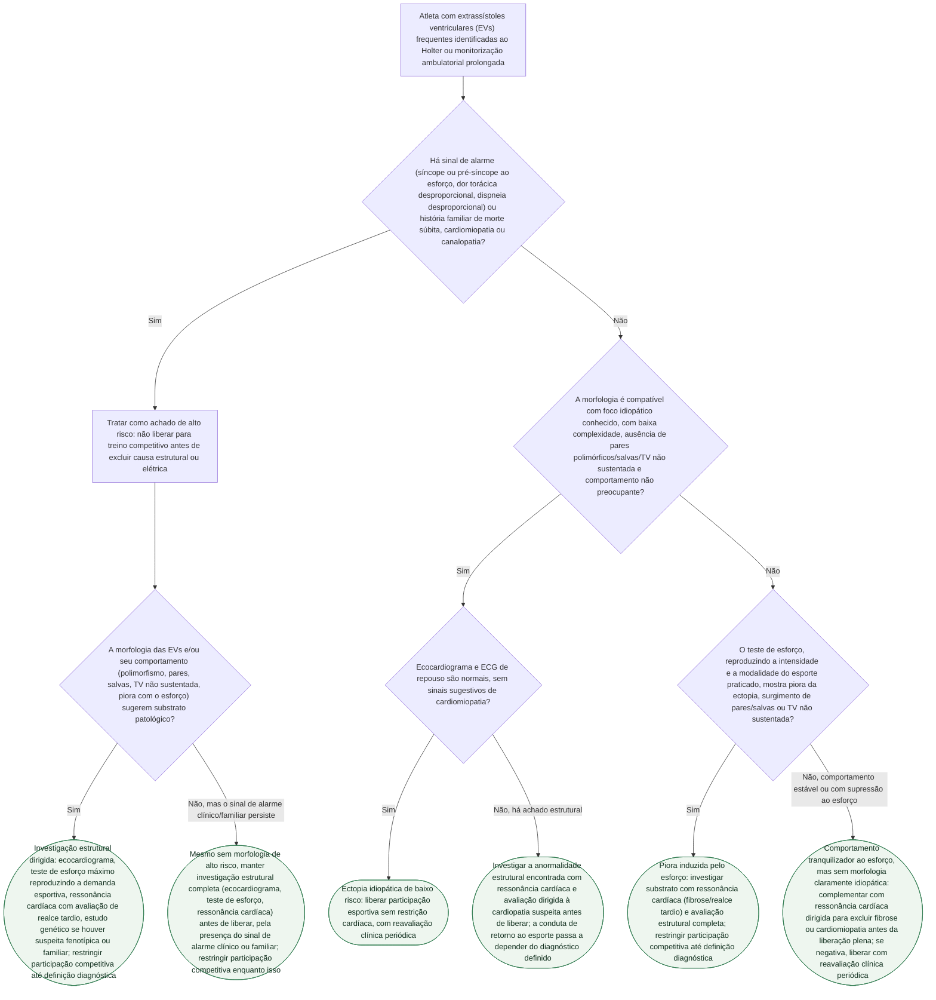

# Extrassístoles ventriculares frequentes ao Holter no atleta: avaliação e liberação esportiva

## Árvore de decisão

## Critérios usados na árvore

A árvore parte do documento já publicado no acervo Corvia (`extrassistoles-e-arritmias-ventriculares-no-atleta`), apoiado no consenso de especialistas da HRS 2024 (Lampert R, et al. *Heart Rhythm*. 2024;21:e151-e252, PMID 38763377) e no *scientific statement* AHA/ACC 2025 (Kim JH, et al. *Circulation*. 2025, PMID 39973614) — ambos PMID conferidos nesta sessão via PubMed E-utilities (`esummary`), título, revista e data batendo exatamente com o citado.

O primeiro corte da árvore é o **sinal de alarme clínico ou familiar**: síncope ou pré-síncope ao esforço, dor torácica ou dispneia desproporcional ao esforço, ou história familiar de morte súbita, cardiomiopatia ou canalopatia. Presente qualquer um deles, a fonte trata o achado como alto risco até prova em contrário, independentemente da morfologia da ectopia — e mesmo quando a morfologia das EVs não é, isoladamente, sugestiva de substrato patológico, a investigação estrutural completa (ecocardiograma, teste de esforço reproduzindo a demanda esportiva real e ressonância cardíaca) precisa ser concluída antes de qualquer liberação, pela presença do próprio sinal de alarme.

Na ausência de sinal de alarme, o corte seguinte é a **morfologia e o comportamento da ectopia**: compatibilidade com foco idiopático conhecido, baixa complexidade, ausência de pares polimórficos, salvas ou taquicardia ventricular não sustentada, e comportamento não preocupante. A fonte é explícita que nenhum desses itens isoladamente confirma benignidade — a conclusão é integrativa, e por isso a árvore ainda exige ecocardiograma e ECG de repouso normais antes de liberar sem restrição.

Quando a morfologia não é claramente idiopática, o teste de esforço — feito em intensidade e modalidade que reproduzam a demanda esportiva real, não interrompido precocemente ao atingir uma frequência-alvo — decide o próximo passo: piora da ectopia ou surgimento de pares/salvas/TV não sustentada aponta para investigação de substrato com ressonância cardíaca; comportamento estável ou com supressão ao esforço é tranquilizador, mas a fonte recomenda ainda assim complementar com ressonância dirigida antes da liberação plena, porque supressão ao esforço não exclui doença estrutural por si só.

A quantidade de EVs não integra nenhum ramo da árvore como critério isolado: a fonte é explícita que a carga (número absoluto) de ectopia não deve ser usada isoladamente como marcador prognóstico em atleta sem doença estrutural conhecida — o que decide é morfologia, complexidade, comportamento ao esforço e substrato estrutural, que é exatamente o que os ramos acima avaliam. A retirada da árvore serve tanto para não fabricar um corte numérico que a fonte não define quanto para não confundir carga de ectopia com risco.

Esta árvore cobre a etapa de **avaliação inicial e estratificação de risco**. A decisão final de retorno ao esporte, quando um substrato estrutural, arritmia associada a cardiomiopatia, miocardite, fibrose relevante ou canalopatia é identificado, depende do manejo específico da doença de base e de nova estratificação — etapa posterior, não coberta por este diagrama, que a fonte trata em conjunto com o consenso HRS 2024 sobre retorno ao esporte em condições arrítmicas complexas.
