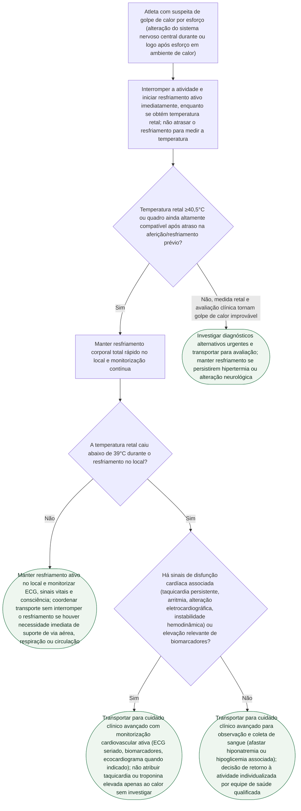

# Golpe de calor por esforço no atleta: reconhecimento e resfriamento

## Árvore de decisão

## Critérios usados na árvore

O golpe de calor por esforço (*exertional heat stroke*) é a manifestação mais grave do espectro de doença por calor relacionada ao esforço, caracterizado pela combinação de hipertermia central importante (frequentemente temperatura retal acima de 40,5°C) e disfunção do sistema nervoso central durante ou logo após esforço físico (Roberts et al., *Curr Sports Med Rep*. 2023, PMID 37036463). Uma medida abaixo desse valor não exclui o diagnóstico quando houve demora, resfriamento prévio ou alta compatibilidade clínica.

O princípio organizador da árvore — **"cool first, transport second"** (resfriar primeiro, transportar depois) — vem do documento do grupo de trabalho de impacto climático adverso do Comitê Olímpico Internacional para os Jogos de Tóquio 2020 (Hosokawa et al., *Br J Sports Med*. 2021, PMID 33888465): ao ser admitido na área dedicada ("heat deck"), o atleta deve ter a temperatura retal aferida — **não** por via oral, axilar ou timpânica — e ser resfriado no local até a temperatura retal ficar **abaixo de 39°C** antes do transporte, desde que não haja necessidade imediata de intervenção vital indisponível no local. Durante o resfriamento é recomendável coletar sangue para descartar hiponatremia ou hipoglicemia associadas, se isso não interromper o resfriamento. O consenso do ACSM de 2023 reforça que o resfriamento não deve aguardar a conclusão da avaliação diagnóstica.

O ramo de disfunção cardíaca reflete a revisão narrativa de 2026 sobre disfunção miocárdica associada ao golpe de calor (Zhuang et al., *West J Emerg Med*. 2026, PMID 42258868), que descreve manifestações cardíacas incluindo lesão miocárdica (elevação de biomarcadores), arritmia e disfunção ventricular, com diagnóstico precoce apoiado em ECG, biomarcadores cardíacos (incluindo troponina, citada explicitamente) e ecocardiograma. A própria fonte não estabelece um corte numérico único e validado de troponina para prognóstico nesse contexto — por isso a árvore usa "elevação relevante de biomarcadores" como critério qualitativo, sem inventar um limiar que a fonte não fornece, e mantém aberta a orientação de que taquicardia e alteração eletrocardiográfica no golpe de calor não devem ser atribuídas ao calor sem investigação, nem devem gerar investigação coronariana invasiva de rotina só pela elevação isolada de troponina. O documento de origem também registra que a literatura de recomendação de exercício em calor ainda não desenvolveu orientação específica de retorno à atividade para o cardiopata nem um intervalo fixo universal de afastamento pós-golpe de calor — por isso a conduta final da árvore remete a decisão individualizada por equipe qualificada, sem propor um prazo que a fonte não sustenta.
