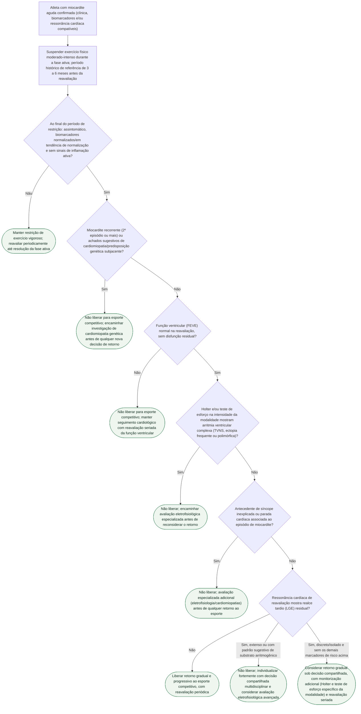

# Miocardite no atleta: fluxograma de decisão para retorno ao esporte competitivo

## Árvore de decisão

## Critérios usados na árvore

A restrição de exercício físico intenso durante a fase ativa da miocardite é conduta histórica e consensual (ESC 2020, task force AHA/ACC anteriores e a atualização AHA/ACC 2025), sustentada pelo risco aumentado de arritmia ventricular e morte súbita associado à inflamação ativa, disfunção ventricular e instabilidade elétrica durante o esforço. O período de referência de 3 a 6 meses citado na árvore vem dessa tradição de diretrizes; a revisão de Dores et al. (2026, *Rev Port Cardiol*) e o statement AHA/ACC 2025 (Kim JH et al., *Circulation*, PMID 39973614) explicitam, porém, que a evidência prospectiva para um intervalo único e universal é limitada — por isso a árvore não trata o tempo isoladamente como critério de liberação, mas apenas como o ponto de corte a partir do qual a reavaliação multiparamétrica deve ocorrer.

O estudo piloto prospectivo de Patriki et al. (2020/2021, *J Cardiovasc Transl Res*, PMID 32367345) testou justamente esse desenho: 30 pacientes com miocardite e FEVE preservada ou apenas discretamente reduzida foram reavaliados aos 3 meses, e todos exceto um foram liberados sem eventos cardíacos no seguimento disponível — o que dá suporte empírico (ainda que de amostra pequena) à lógica de reavaliação multiparamétrica ao final da restrição, em vez de liberação automática por tempo decorrido.

A árvore incorpora, na ordem em que a literatura consistentemente aponta como determinantes de maior cautela (Kim JH et al. 2025; Lampert R et al., HRS 2024, PMID 38763377; Dores H et al. 2026, PMID 42061508): recorrência do episódio ou suspeita de cardiomiopatia genética subjacente; disfunção ventricular residual; arritmia ventricular complexa documentada em monitorização ou teste de esforço específico da modalidade; síncope inexplicada ou parada cardíaca associada ao quadro; e, por fim, o achado de realce tardio (LGE) residual na ressonância cardíaca de reavaliação.

O nó sobre LGE residual reflete explicitamente a zona de incerteza descrita nas fontes: a persistência de realce tardio após resolução clínica não equivale automaticamente a inflamação ativa ou a proibição esportiva, e seu significado depende de padrão, extensão e associação com os demais marcadores de risco já avaliados nos nós anteriores da árvore. Por isso a árvore só classifica o LGE residual como impeditivo de liberação quando ele é extenso ou tem padrão compatível com substrato arritmogênico; LGE discreto e isolado, na ausência de qualquer outro marcador de risco, é tratado como cenário de decisão compartilhada com monitorização adicional, e não como contraindicação automática — consistente com a ênfase do statement AHA/ACC 2025 e do HRS 2024 em avaliação individualizada e decisão compartilhada no esporte, evitando tanto exposição irresponsável ao risco quanto exclusão esportiva desnecessária.
