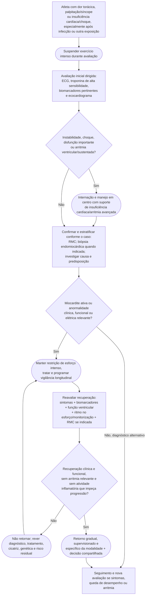

# Miocardite no atleta: da suspeita ao retorno

## Como interpretar

- A apresentação clássica pode ser dor torácica, arritmia/síncope ou insuficiência cardíaca/choque.
- Troponina normal não exclui isoladamente todos os casos; a probabilidade clínica e os demais testes importam.
- Ressonância cardíaca é central para diagnóstico não invasivo e estratificação; biópsia é reservada para indicações clínicas específicas.
- Retorno não deve depender somente do número de meses transcorridos. Recuperação clínica, função, ritmo e atividade inflamatória precisam ser integrados.
- Cicatriz residual e incerteza prognóstica devem entrar na decisão compartilhada e no plano de seguimento.

## Conteúdo conectado

- [Diretriz AHA/ACC 2025 sobre participação esportiva](/biblioteca/diretriz-participacao-esportiva-aha-acc-2025)
- [Miocardite no atleta e retorno ao esporte](/biblioteca/miocardite-retorno-ao-esporte)
- [COVID-19, miocardite pós-viral e triagem](/biblioteca/covid-19-miocardite-pos-viral-atleta-triagem-retorno-esporte)
- [Imagem avançada no atleta](/biblioteca/imagem-avancada-atleta-rmc-tc-nuclear-2026)

## Limite

O fluxo não substitui manejo etiológico da miocardite nem define autorização esportiva para um caso individual. Instabilidade ou arritmia grave exige atendimento emergencial.
