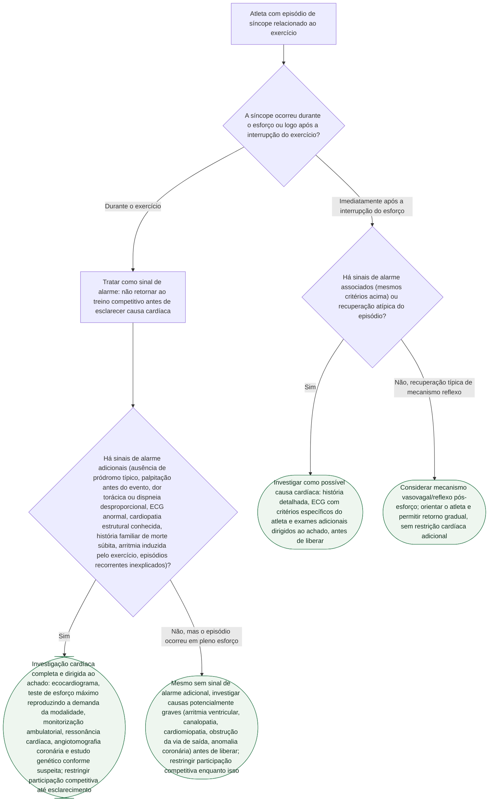

# Síncope durante o exercício no atleta

## Árvore de decisão

## Critérios usados na árvore

O documento de origem, apoiado no consenso HRS 2024 (Lampert R, et al. *Heart Rhythm*. 2024. PMID 38763377) e no statement AHA/ACC 2025 (Kim JH, et al. *Circulation*. 2025. PMID 39973614), estabelece que a síncope no atleta deve ser interpretada primeiro **pelo momento em relação ao esforço**. Perder a consciência durante o exercício levanta suspeita para mecanismos potencialmente graves — arritmia ventricular, canalopatia, cardiomiopatia, obstrução dinâmica ou fixa da via de saída, anomalia coronária e doença estrutural — e deve ser tratada como sinal de alarme até que essas causas sejam excluídas, independentemente de outros achados. Já a síncope logo após a interrupção do esforço pode ter mecanismo reflexo (redução abrupta do retorno venoso), especialmente se o atleta ficou imóvel após esforço intenso — mas isso não é presumido automaticamente: a fonte é explícita que "síncope pós-esforço não é automaticamente benigna".

Os sinais que aumentam a preocupação, listados literalmente na fonte, são: síncope durante o esforço, ausência de pródromos típicos de mecanismo reflexo, palpitação imediatamente antes do evento, dor torácica ou dispneia desproporcional, ECG anormal, cardiopatia estrutural conhecida, história familiar de morte súbita prematura ou canalopatia/cardiomiopatia, arritmia induzida pelo exercício e episódios recorrentes sem explicação convincente.

A fonte recomenda que a avaliação comece por história direcionada, exame físico e ECG de 12 derivações com critérios específicos do atleta, escalando — conforme o achado — para ecocardiograma, teste de esforço máximo reproduzindo a demanda fisiológica da modalidade, monitorização ambulatorial, ressonância cardíaca, angiotomografia coronária e estudo genético quando há suspeita fenotípica ou familiar apropriada. Um atleta com síncope inexplicada durante exercício não deve retornar ao treino competitivo intenso antes de esclarecer causas cardíacas relevantes — restrição inicial de segurança, não proibição permanente. O retorno definitivo depende do diagnóstico final, do tratamento quando necessário, da ausência de arritmia relevante em avaliação apropriada e do risco residual específico da doença, sempre por decisão compartilhada — etapa posterior à árvore acima, que cobre a investigação inicial.