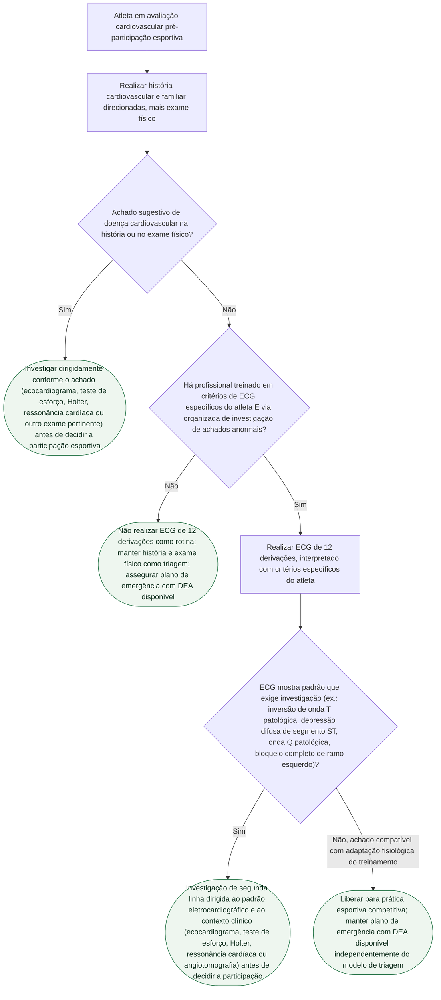

# Triagem cardiovascular pré-participação esportiva e ECG do atleta

## Árvore de decisão

## Critérios usados na árvore

A declaração científica AHA/ACC 2025 (Kim JH et al., *J Am Coll Cardiol*. 2025;85(10):1059-1108; versão simultânea em *Circulation*. 2025;151:e716-e761) abandonou a dicotomia simples "ECG para todos" versus "ECG para ninguém". História cardiovascular e exame físico direcionados continuam obrigatórios em qualquer cenário, mas têm sensibilidade limitada para doença silenciosa.

O ECG de 12 derivações é considerado **razoável** de incluir no rastreamento, mas essa recomendação vem condicionada: o programa precisa ter profissional treinado em critérios contemporâneos específicos do atleta e uma via organizada de investigação dos achados anormais. Sem esse ecossistema, o próprio documento de origem alerta que um programa de ECG gera falsos positivos, exames desnecessários, ansiedade, custo e afastamento esportivo indevido — por isso a árvore trata a ausência dessa estrutura como motivo para não fazer ECG de rotina, e não como motivo para pular a etapa de investigação.

Achados eletrocardiográficos que justificam investigação dirigida, citados explicitamente na fonte: padrões específicos de inversão de onda T, depressão difusa do segmento ST, ondas Q patológicas e bloqueio completo de ramo esquerdo. Ecocardiograma, teste de esforço e monitorização ambulatorial de ritmo **não** são recomendados como rastreamento universal de primeira linha em atleta assintomático — são testes de segunda linha, selecionados conforme o achado clínico ou eletrocardiográfico, o que a árvore reflete ao só indicá-los depois de um achado positivo em uma das duas etapas anteriores.

A fonte também é explícita que nenhum programa de triagem elimina o risco de morte súbita — por isso plano de emergência (reconhecimento rápido de parada cardíaca, RCP de alta qualidade, DEA disponível, sistema coordenado de transporte) é indicado como parte da prevenção **independentemente** de qual ramo da árvore o atleta percorreu, e não foi desenhado como um ramo próprio, para não fragmentar essa recomendação transversal em vários nós repetidos.