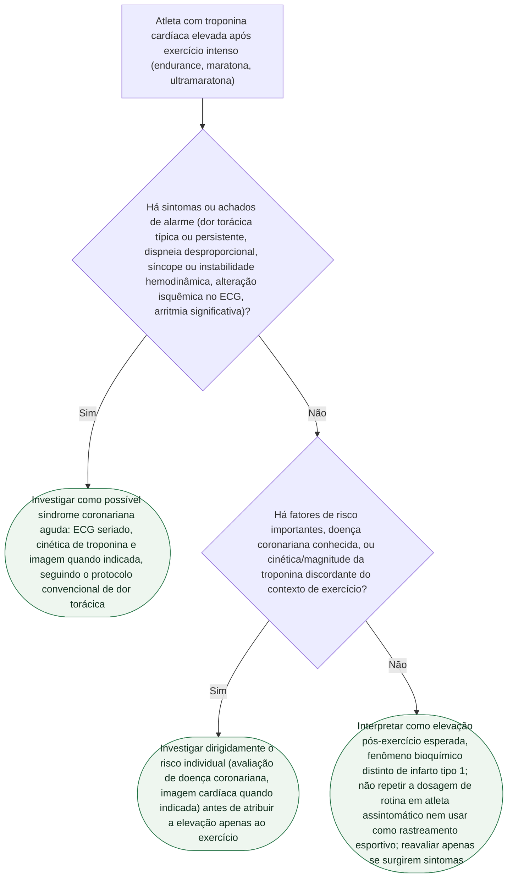

# Troponina após exercício intenso no atleta: interpretação

## Árvore de decisão

## Critérios usados na árvore

O documento de origem reúne meta-análises e estudos observacionais que mostram que elevação de troponina cardíaca acima do percentil 99 após exercício prolongado ou muito intenso **não é rara**: uma meta-análise de 2026 com 129 estudos e 7.289 atletas (Stekelenburg et al., PMID 41985028) encontrou 36% de elevação acima do limite superior de referência, com pico de 52% entre 3 e 6 horas após esforços de endurance. Um estudo com corredores da Maratona de Pequim (Wang et al., PMID 38697867) encontrou mais de 72% acima do percentil 99, com normalização em duas semanas. Por isso a mensagem central da fonte é que **troponina elevada significa injúria miocárdica bioquímica, mas não define sozinha infarto agudo do miocárdio**.

Os achados que, segundo a fonte, tornam a hipótese de doença aguda relevante e exigem investigação convencional são: dor torácica típica ou persistente, dispneia desproporcional, síncope ou instabilidade hemodinâmica, alterações isquêmicas no ECG, arritmia significativa, elevação com cinética ou magnitude discordante do contexto, fatores de risco importantes ou doença coronariana conhecida, e achados de imagem sugestivos de isquemia, miocardite ou outra injúria estrutural. A árvore separa os dois primeiros grupos de critérios (sintomas/ECG/hemodinâmica versus risco basal/cinética) em dois nós de decisão sequenciais, porque a fonte trata o exercício recente como algo que **modifica a probabilidade diagnóstica, mas não elimina diagnósticos graves** — mesmo sem sintoma agudo, um atleta com aterosclerose coronária conhecida (Janssen et al., PMID 38363583) não deve ter o achado atribuído automaticamente ao exercício.

O estudo de Airaksinen et al. (PMID 39551608), que comparou a composição da troponina liberada por corredores versus pacientes com infarto tipo 1, é citado na fonte como informação fisiopatológica que reforça a distinção biológica — mas o próprio documento de origem adverte que isso **não é um teste clínico capaz de descartar infarto individualmente**, e por isso não foi transformado em critério de decisão na árvore. Por fim, a fonte é explícita que dosar troponina de rotina em atleta assintomático, fora de uma pergunta clínica definida, não tem papel estabelecido como estratégia de rastreamento — reafirmado na conduta final da árvore.