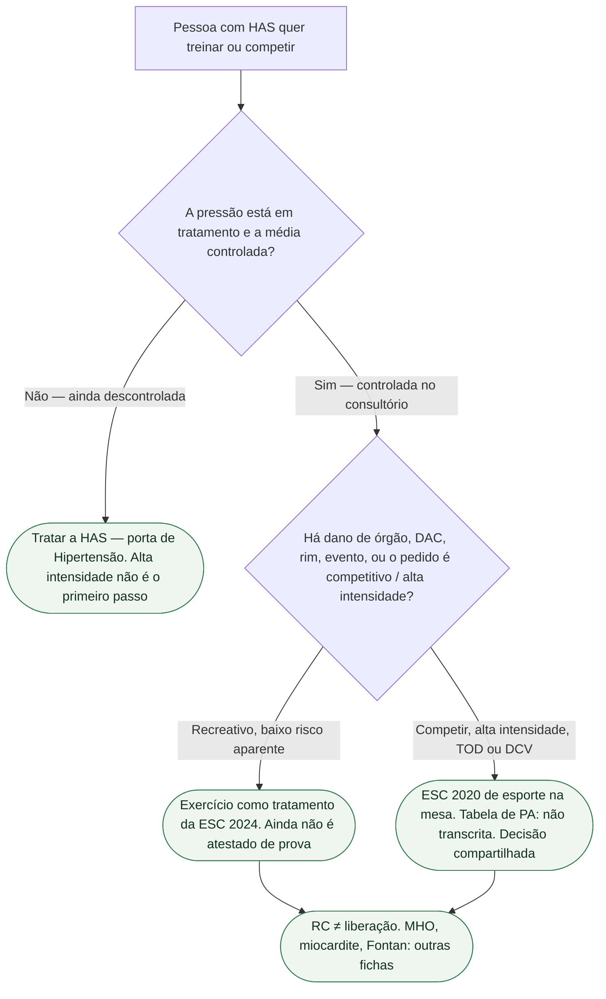

# HAS controlada não é liberação esportiva automática

A pergunta desta porta: **a pressão controlada no consultório — ou a meta da diretriz de hipertensão — libera este paciente para competir?** A resposta é **não**. Controlar HAS é tratamento. Liberação esportiva é outra decisão, com outra diretriz na mesa. Esta ficha **não** republica MHO ([MHO e esporte: o que o SEQUOIA-HCM não autoriza](/biblioteca/mho-e-esporte-o-que-sequoia-nao-autoriza)), miocardite ([Retorno ao esporte após miocardite — ESC 2025](/biblioteca/retorno-ao-esporte-apos-miocardite-esc-2025)), Fontan/Eisenmenger ([Fontan e Eisenmenger não herdam a ficha de MHO](/biblioteca/fontan-e-eisenmenger-nao-herdam-a-ficha-de-mho)) nem RC ≠ atestado ([Reabilitação cardíaca não é liberação esportiva](/biblioteca/rc-nao-e-liberacao-esportiva)). Não inventa corte de pressão para esporte.

## Duas mesas, duas perguntas

**Mesa da hipertensão.** A ESC 2024 de pressão elevada e hipertensão (McEvoy et al., *Eur Heart J*. 2024;**45**:3912-4018; PMID **39210715**) trata exercício como **peça do tratamento** da HAS: atividade aeróbica, treino de resistência complementar, individualizar por idade, sexo, comorbidade e preferência. Isso reduz pressão e risco. **Não** é “apto a competir”. A própria diretriz remete o detalhe de prescrição, rastreio pré-participação e teste à ESC 2020 de cardiologia do esporte. Meta de consultório, MAPA e dano mediado pela hipertensão moram na ficha de HAS — **não se copiam aqui como atestado**.

Na avaliação pré-participação: a decisão de exercitar-se — sobretudo **competir** — é **compartilhada** (paciente, família, quem trata a HAS, medicina do esporte). Controle no consultório documenta que o tratamento da pressão aconteceu. Nenhum dos dois é o atestado.

## Por que “controlada” não fecha o esporte

Quatro razões, nenhuma de estilo:

1. **Pergunta errada.** O contraste da diretriz de HAS é tratar versus não tratar a pressão. O contraste da liberação é recreativo versus competitivo, baixa versus alta intensidade, com ou sem dano de órgão. Controlar a média **não** responde a modalidade.
2. **Dano de órgão-alvo não some no número do consultório.** Hipertrofia, doença coronariana, doença crônica do rim, retinopatia ou antecedente de evento **continuam** na mesa do esporte mesmo com a média controlada. A ESC 2024 nomeia dano mediado pela hipertensão; **não** o transforma em “já passou, pode jogar”.
3. **Intensidade e colisão não herdam a consulta de rotina.** Quem caminha no programa de RC **não** sai com autorização de prova, luta ou mergulho. RC documenta treino supervisionado ([Reabilitação cardíaca não é liberação esportiva](/biblioteca/rc-nao-e-liberacao-esportiva)). **Não** é esporte competitivo no dia da alta.
4. **HAS descontrolada e HAS controlada não são a mesma porta — e nenhuma das duas é a tabela transcrita.** Descontrolada pede tratar **antes** de discutir alta intensidade. Controlada pede a diretriz de esporte **aberta**, não o carimbo da última consulta. Sem milímetro inventado.

PREVENT, meta de consultório e início de fármaco são portas de **Hipertensão**. Não entram aqui como clearance. SEQUOIA e MAPLE mediram VO₂ em MHO — **não** em HAS. Piso de um mês após IMPS é miocardite/pericardite — **não** copie para hipertenso estável. Fontan e Eisenmenger **não** herdam esta ficha.

## O que dizer na consulta

> “Ter a pressão controlada é o tratamento da hipertensão. Não é o papel que libera para competir. Exercício faz parte do tratamento. Liberação esportiva é outra conversa, com a diretriz de esporte aberta — sem copiar o número da última consulta como atestado.”

Não diga “a pressão está boa, está liberado”. Não diga “terminou a RC, pode correr prova”. Não invente milímetro de mercúrio para esporte. Não misture mavacamten, SEQUOIA, Fontan ou o mês da miocardite.

## Tudo com Tudo

- **Cardiologia do Esporte e do Exercício:** esta ficha. HAS controlada ≠ clearance. Tabela ESC 2020 de pressão e esporte: **não transcrita**.
- **Hipertensão:** ESC 2024 (PMID **39210715**) — exercício como tratamento. Meta, PREVENT e fármaco: outras portas. Não herdam atestado.
- **Reabilitação cardíaca:** quatro peças da ESC 2026; treino supervisionado ≠ esporte competitivo. [Reabilitação cardíaca não é liberação esportiva](/biblioteca/rc-nao-e-liberacao-esportiva).
- **Cardiomiopatias / Pericárdio / Cardiopatias congênitas:** MHO, IMPS e Fontan são **outras** fichas. Não colar.
- **Comunicação clínica:** prometer o tratamento da pressão; recusar “liberado para jogar”.
- **Cardiologia geriátrica:** idade não inventa segundo corte de esporte. Fragilidade individualiza; sem número fabricado.

### Leituras conectadas

- [Fontan e Eisenmenger não herdam a ficha de MHO](/biblioteca/fontan-e-eisenmenger-nao-herdam-a-ficha-de-mho)
- [MHO e esporte: o que o SEQUOIA-HCM não autoriza](/biblioteca/mho-e-esporte-o-que-sequoia-nao-autoriza)
