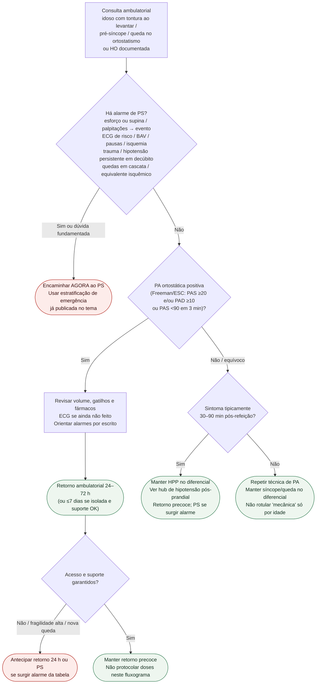

# Fluxograma ambulatorial: hipotensão ortostática no idoso — destino

Prosa: [`sinalizadores-ambulatoriais-hipotensao-ortostatica-idoso-quando-encaminhar`](sinalizadores-ambulatoriais-hipotensao-ortostatica-idoso-quando-encaminhar.md). Quedas + fármacos: [`quedas-farmacos-cv-ortostatismo-idoso-quando-encaminhar-ambulatorial`](quedas-farmacos-cv-ortostatismo-idoso-quando-encaminhar-ambulatorial.md). Emergência: [`sincope-e-queda-no-idoso-estratificacao-de-risco-na-emergencia`](sincope-e-queda-no-idoso-estratificacao-de-risco-na-emergencia.md).

## Árvore de decisão

## Notas

- **D1** = gate de segurança (alto risco ESC 2018 + trauma + cascata + equivalente isquêmico).
- **D2** = braço HO documentada sem alto risco → destino clínico precoce, não alta sem plano.
- **D3** = ponte para HPP (hub já em main); HO e HPP podem coexistir.
- Não decide indicação de marca-passo, Holter de longo prazo, doses nem estratégia invasiva.
