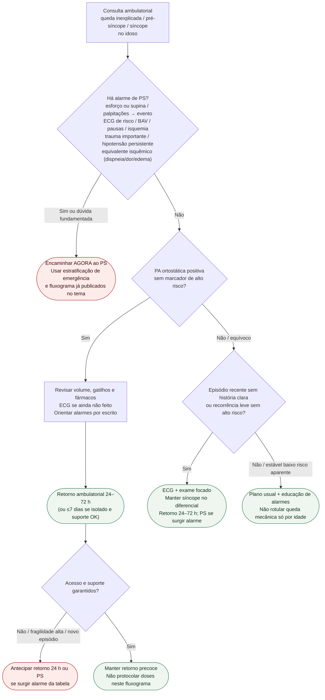

# Fluxograma ambulatorial: queda/síncope no idoso — destino

Prosa: [`sinalizadores-ambulatoriais-queda-sincope-idoso-quando-encaminhar`](sinalizadores-ambulatoriais-queda-sincope-idoso-quando-encaminhar.md). Emergência: [`sincope-e-queda-no-idoso-estratificacao-de-risco-na-emergencia`](sincope-e-queda-no-idoso-estratificacao-de-risco-na-emergencia.md).

## Árvore de decisão

## Notas

- **D1** = gate de segurança (alto risco ESC 2018 + trauma + equivalente isquêmico AHA 2023).
- **D2** = braço ortostático sem alto risco → destino clínico precoce, não alta sem plano.
- **D3** = queda sem história clara permanece síncope no diferencial até prova em contrário.
- Não decide indicação de marca-passo, Holter de longo prazo, doses nem estratégia de SCA invasiva.
