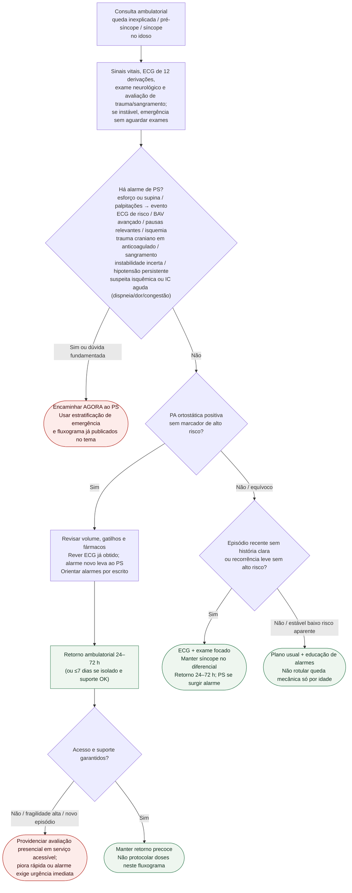

# Fluxograma ambulatorial: queda/síncope no idoso — destino

Prosa: [sinalizadores-ambulatoriais-queda-sincope-idoso-quando-encaminhar](/biblioteca/sinalizadores-ambulatoriais-queda-sincope-idoso-quando-encaminhar). Emergência: [sincope-e-queda-no-idoso-estratificacao-de-risco-na-emergencia](/biblioteca/sincope-e-queda-no-idoso-estratificacao-de-risco-na-emergencia).

## Árvore de decisão

## Notas

- **D1** = triagem de segurança (alto risco ESC 2018 + trauma + equivalente isquêmico AHA 2023).
- **D2** = braço ortostático sem alto risco → destino clínico precoce, não alta sem plano.
- **D3** = queda sem história clara permanece síncope no diferencial até prova em contrário.
- Não decide indicação de marca-passo, Holter de longo prazo, doses nem estratégia de SCA invasiva.

## Limites antes de retorno

ECG normal isolado não afasta SCA. Se suspeita aguda residual, concluir avaliação seriada segura em unidade adequada; não enviar para casa aguardando troponina. Delirium, fadiga, náusea e queda são inespecíficos: avaliar infecção, hipovolemia, medicamentos, distúrbios metabólicos, AVC e outras causas simultaneamente.

Hipotensão ortostática positiva não exclui arritmia, valvopatia, hemorragia ou doença neurológica. Avaliar consequência da queda, especialmente trauma craniano/sangramento em anticoagulado. Instabilidade incerta, IC aguda ou suspeita isquêmica exige avaliação imediata. Retorno em dias só após afastamento razoável das emergências, estabilidade documentada e rede segura. Fragilidade e objetivos modulam tratamento após avaliação, sem atrasar reconhecimento.
Os intervalos de retorno indicados são sugestões operacionais ajustadas à gravidade e ao acesso; não constituem prazos fixados pela ESC.
