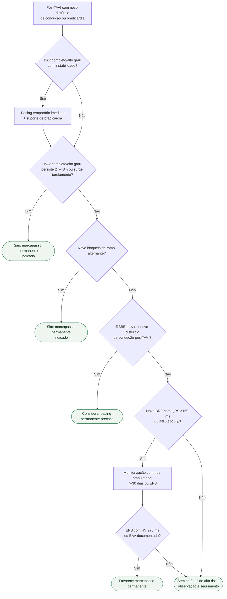

# Distúrbio de condução após TAVI

## Regra prática

**24–48 h** é a janela decisiva para BAV alto grau persistente pós-TAVI; novo BRE isolado exige estratificação por PR/QRS e monitorização, não implante automático.