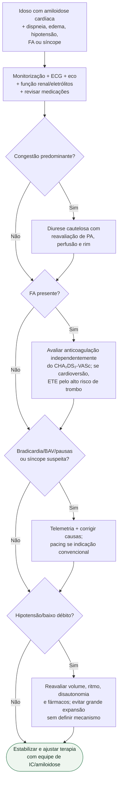

# Descompensação aguda da amiloidose cardíaca

## Regra prática

Em amiloidose, **FA e condução são tão importantes quanto congestão**. A piora aguda pode não responder bem a simplesmente intensificar o tratamento convencional de ICFEr.