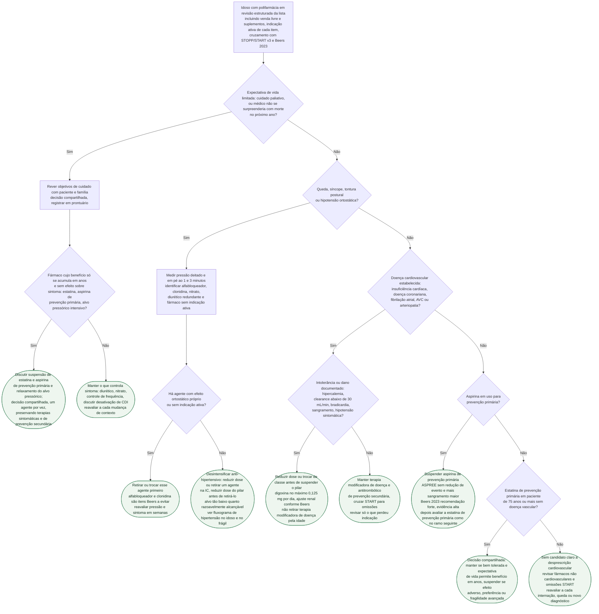

# Fluxograma: Desprescrição cardiovascular no idoso — polifarmácia, fragilidade e fim de vida

Desprescrever é retirar um fármaco de forma deliberada, com motivo registrado e reavaliação marcada — o oposto da suspensão silenciosa que acontece na alta ou na troca de médico. No idoso cardiopata a lista raramente é curta: quatro pilares de insuficiência cardíaca, anticoagulante, estatina, antidiabético e algo para dor já ultrapassam o corte convencional de polifarmácia de 5 fármacos ou mais. A pergunta que esta árvore organiza não é "quantos remédios são demais", e sim qual deles perdeu a indicação para este paciente, neste contexto: o que muda quando a expectativa de vida encurta, o que muda quando ele cai, e o que não muda só porque ele envelheceu. A declaração científica da AHA 2026 sobre desprescrição fixa as quatro estratégias que sustentam cada ramo — gatilho clínico, ferramenta validada, decisão compartilhada e equipe — sem definir cortes por classe; os cortes aqui vêm dos ensaios e critérios citados em cada seção.

## Árvore de decisão

## A raiz: revisão estruturada com STOPP/START v3 e Beers 2023

A revisão que abre a árvore vale para todos os ramos e por isso não é um nó: listar tudo, inclusive venda livre e suplementos; perguntar, item a item, se a indicação ainda existe; e cruzar a lista com ferramentas validadas. O STOPP/START versão 3 tem 190 critérios — 133 STOPP, de fármacos a evitar, e 57 START, de omissões a corrigir —, validados por 11 médicos de 8 países europeus em 4 rodadas Delphi. Este fluxograma usa a estrutura da ferramenta, mas não reproduz a redação de critérios individuais; para aplicá-los, deve-se consultar o apêndice oficial.

Os Critérios de Beers 2023 se aplicam a adultos de 65 anos ou mais em qualquer cenário ambulatorial, agudo ou institucional, exceto hospice e cuidado de fim de vida — o próprio documento diz que nesse contexto a decisão exige outras considerações, o que justifica o ramo D1 vir antes de qualquer cruzamento de lista. O painel também lembra que os critérios não devem ser usados de forma punitiva e que desprescrever exige decisão compartilhada.

| Item cardiovascular dos Beers 2023 | Recomendação |
|---|---|
| Aspirina para prevenção primária | Evitar iniciar; considerar desprescrever em quem já usa. Evidência alta, recomendação forte. Não se aplica à prevenção secundária |
| Alfabloqueador periférico não seletivo (doxazosina, prazosina, terazosina) | Evitar como anti-hipertensivo; evitar em síncope de possível origem ortostática |
| Clonidina e outros alfa-agonistas centrais | Evitar clonidina como primeira linha e os demais como anti-hipertensivo |
| Diltiazem, verapamil | Evitar em IC com fração de ejeção reduzida |
| Amiodarona | Evitar como primeira linha em FA, salvo IC ou hipertrofia ventricular substancial |
| Digoxina | Não é primeira linha em FA nem em IC; se usada, evitar dose acima de 0,125 mg por dia; cautela ao suspender em usuário crônico com IC de fração reduzida |
| Varfarina | Evitar iniciar se DOAC disponível; em uso crônico bem controlado pode ser razoável manter |
| Espironolactona, amilorida, triantereno | Evitar com clearance abaixo de 30 mL/min (hipercalemia) |

## Expectativa de vida limitada: o que Kutner 2015 mostra

O gatilho do ramo D1 é o do próprio ensaio: pelo menos um médico que "não se surpreenderia se o paciente morresse no próximo ano", expectativa de vida estimada entre 1 mês e 1 ano e declínio funcional recente (Karnofsky abaixo de 80% nos 3 meses anteriores). Kutner e colaboradores randomizaram 381 adultos em uso de estatina há 3 meses ou mais, idade média de 74,1 anos, 48,8% com câncer, para suspender (189) ou manter (192) o fármaco.

| Desfecho | Suspender | Manter | Resultado |
|---|---|---|---|
| Morte em 60 dias (primário) | 23,8% | 20,3% | IC90% da diferença −3,5 a 10,5 pontos, p=0,36 |
| Qualidade de vida (McGill QOL) | 7,11 | 6,85 | p=0,04 a favor de suspender |
| Eventos cardiovasculares | 13 | 11 | Poucos em ambos os braços |
| Custo | — | — | Economia média de US$ 3,37 por dia e US$ 716 por paciente |

O ensaio encontrou mortalidade em 60 dias semelhante, pequena melhora de qualidade de vida e poucos eventos cardiovasculares, mas não autoriza suspensão automática nem foi desenhado para resolver todos os cenários de prevenção secundária. A conduta C1 é, por isso, uma discussão compartilhada no paciente com prognóstico limitado, priorizando fármacos sem benefício sintomático e de prevenção primária. O mesmo raciocínio alcança aspirina de prevenção primária e alvo pressórico intensivo. O que controla sintoma permanece; a desativação do choque do CDI é conversa própria, em marca-passo-e-cdi-no-muito-idoso-indicacao-e-desativacao-em-fim-de-vida.

## Queda e ortostatismo: primeiro o agente errado, depois a dose

O ramo D3 segue a ordem da ESC 2024 já detalhada no fluxograma de hipertensão no idoso: medir a pressão deitado e em pé ao 1 e 3 minutos (queda de 20 mmHg ou mais na sistólica e/ou 10 mmHg ou mais na diastólica define hipotensão ortostática), procurar causa reversível e trocar o fármaco desencadeante antes de reduzir a intensidade global. Os Beers 2023 nomeiam os dois agentes a sair primeiro — alfabloqueador periférico e clonidina, ambos por ortostatismo — e o STOPP v3 reúne 12 critérios de fármacos que aumentam o risco de queda. Só quando não há agente com efeito ortostático próprio nem fármaco sem indicação é que a árvore chega a C4: reduzir dose ou retirar um agente, com alvo "tão baixo quanto razoavelmente alcançável". Achado ortostático assintomático isolado não é motivo de desescalonar — hipotensao-ortostatica-nao-e-motivo-para-desescalonar-o-anti-hipertensivo.

## Doença cardiovascular estabelecida: o que não se retira por idade

Na prevenção secundária a metanálise CTT 2019 não mostrou atenuação significativa do benefício da estatina com a idade (ptrend=0,2 entre pacientes com doença vascular), e os Beers 2023 registram explicitamente que a aspirina é indicada em prevenção secundária. A terapia modificadora de doença da IC não é candidata a desprescrição pela idade: o caminho diante de hipercalemia, piora renal, bradicardia ou hipotensão é reduzir dose, espaçar titulação ou trocar de classe, como descrito em insuficiencia-cardiaca-no-muito-idoso-sequenciamento-dos-quatro-pilares. Os Beers acrescentam dois cuidados cardiológicos específicos: digoxina no máximo 0,125 mg por dia, com cautela ao suspender em usuário crônico com fração reduzida, e ajuste renal dos antitrombóticos e poupadores de potássio. Polifarmácia também é omissão — START cobre anticoagulante ausente na FA de alto risco e estatina ausente após evento coronariano.

## Prevenção primária: aspirina sai, estatina é decisão compartilhada

| Ensaio | População | Intervenção | Desfecho cardiovascular | Sangramento maior |
|---|---|---|---|---|
| ASPREE (McNeil 2018) | 19.114 pessoas de 70 anos ou mais (65 ou mais entre negros e hispânicos nos EUA), sem DCV, demência ou incapacidade; seguimento mediano 4,7 anos | Aspirina 100 mg com revestimento entérico vs. placebo | 10,7 vs. 11,3 eventos por 1.000 pessoas-ano, HR 0,95 (IC95% 0,83–1,08) | 8,6 vs. 6,2 por 1.000 pessoas-ano, HR 1,38 (IC95% 1,18–1,62), p<0,001 |

A análise de mortalidade da mesma coorte (12,7 vs. 11,1 mortes por 1.000 pessoas-ano, HR 1,14, IC95% 1,01–1,29, sobretudo por câncer) está em aspirina-em-prevencao-primaria-no-idoso-saudavel-o-ensaio-aspree, com a ressalva de cautela dos próprios autores. É esse conjunto que sustenta a conduta C7 e a recomendação forte dos Beers.

A estatina de prevenção primária em 75 anos ou mais é diferente: a CTT 2019 encontrou redução de eventos vasculares em todas as faixas etárias, mas com sinal de menor benefício justamente no idoso sem doença vascular (ptrend=0,05), e a ESC/EAS 2019 classifica o início nessa faixa como Classe IIb, nível B ("pode ser considerado, se em risco alto ou acima") — a metanálise está detalhada em estatina-em-prevencao-primaria-no-muito-idoso-o-que-prosper-e-a-metanalise-ctt-mostram e a recomendação da diretriz em metas-terapeuticas-cardiovasculares-no-muito-idoso. Por isso C8 não é "suspender": é pesar tolerância, expectativa de vida suficiente para o benefício se materializar e preferência do paciente.

## Reavaliar a cada mudança de contexto

A árvore é percorrida de novo a cada internação, queda, novo diagnóstico, entrada em cuidado paliativo ou progressão de fragilidade — o ramo em que o paciente estava no ano passado pode não ser o de hoje. Retirar um fármaco por vez, com reavaliação marcada, é o que permite atribuir qualquer mudança clínica ao fármaco suspenso; e a desprescrição deve ser registrada no prontuário e comunicada na transição de cuidado, para não ser lida como discrepância e revertida na próxima reconciliação (ver fluxograma-reconciliacao-medicamentosa-na-transicao-de-cuidado).

## Limitações

- O fluxograma não reproduz critérios STOPP/START individuais; a aplicação literal exige consulta ao apêndice oficial.
- O Kutner 2015 não deve ser extrapolado como ordem automática de suspensão em prevenção secundária.
- Kutner 2015 é ensaio aberto, pragmático, com metade da amostra oncológica; extrapolar para o cardiopata em prevenção secundária com prognóstico limitado é decisão compartilhada, não conduta automática.
- O gatilho "expectativa de vida limitada" desta árvore combina a pergunta surpresa de Kutner (1 ano) com a expectativa abaixo de 3 anos usada pela ESC 2024 para adiar anti-hipertensivo; a árvore não fixa um único corte temporal.
- Os Beers 2023 não trazem critério de anti-hipertensivo ou diurético em histórico de queda; o critério de queda deles é de fármacos ativos no SNC. O ramo D3 vem da ESC 2024 e do STOPP v3, não dos Beers.
- A declaração AHA 2026 sobre desprescrição foi lida apenas pelo resumo indexado; nenhum corte por classe vem dela.
- Nenhuma dose de retirada gradual (betabloqueador, clonidina) foi conferida; a árvore diz "reduzir dose ou retirar um agente" sem esquema numérico.

## Tudo com Tudo

- [Polifarmácia Cardiovascular no Idoso: Cascata de Prescrição, STOPP/START e Critérios de Beers Aplicados à Cardiologia](/biblioteca/polifarmacia-cardiovascular-no-idoso-cascata-de-prescricao-e-desprescricao)
- [Desprescrição de Medicamentos Cardiovasculares na Polifarmácia (consenso científico AHA 2026)](/biblioteca/desprescricao-de-medicamentos-cardiovasculares-na-polifarmacia-consenso-cientifico-aha-2026)
- [Fluxograma: Hipertensão no idoso e no frágil — quando iniciar, alvo e desintensificação (ESC 2024)](/biblioteca/fluxograma-hipertensao-no-idoso-e-no-fragil-quando-iniciar-alvo-e-desintensificacao-esc-2024)
- [Aspirina em Prevenção Primária no Idoso Saudável: o Ensaio ASPREE](/biblioteca/aspirina-em-prevencao-primaria-no-idoso-saudavel-o-ensaio-aspree)
- [Estatina em Prevenção Primária no Muito Idoso (≥75 Anos): o que PROSPER e a Metanálise CTT Mostram — e Onde a Evidência é Genuinamente Mais Fraca](/biblioteca/estatina-em-prevencao-primaria-no-muito-idoso-o-que-prosper-e-a-metanalise-ctt-mostram)
- [Marca-Passo e Cardiodesfibrilador Implantável no Muito Idoso: da Indicação Compartilhada à Desativação em Cuidados de Fim de Vida](/biblioteca/marca-passo-e-cdi-no-muito-idoso-indicacao-e-desativacao-em-fim-de-vida)
- [Fluxograma: Reconciliação Medicamentosa na Transição de Cuidado](/biblioteca/fluxograma-reconciliacao-medicamentosa-na-transicao-de-cuidado)
