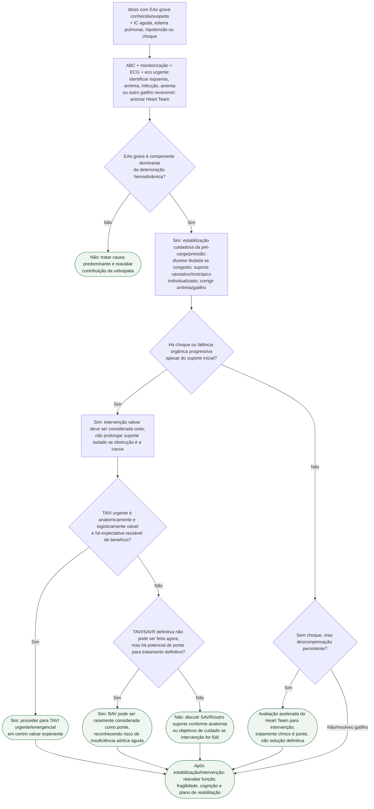

# EAo grave descompensada/choque no idoso

## Regra prática

Quando a EAo grave é a causa mecânica do choque, **o suporte clínico ganha tempo, mas não remove a obstrução**. A ESC/EACTS 2025 favorece avaliação intervencionista precoce; BAV é hoje principalmente uma ponte rara em casos selecionados.
