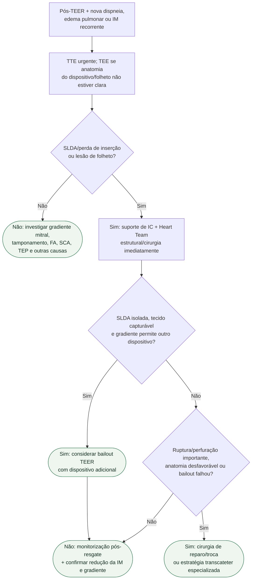

# Falha de TEER mitral

```mermaid
flowchart TD
  R0["Pós-TEER + nova dispneia,<br/>edema pulmonar ou IM recorrente"]
  P1["TTE urgente; TEE se anatomia<br/>do dispositivo/folheto não estiver clara"]
  D1{"SLDA/perda de inserção<br/>ou lesão de folheto?"}
  C1(["Não: investigar gradiente mitral,<br/>tamponamento, FA, SCA, TEP e outras causas"])
  P2["Sim: suporte de IC + Heart Team<br/>estrutural/cirurgia imediatamente"]
  D2{"SLDA isolada, tecido capturável<br/>e gradiente permite outro dispositivo?"}
  C2(["Sim: considerar bailout TEER<br/>com dispositivo adicional"])
  D3{"Ruptura/perfuração importante,<br/>anatomia desfavorável ou bailout falhou?"}
  C3(["Sim: cirurgia de reparo/troca<br/>ou estratégia transcateter especializada"])
  C4(["Não: monitorização pós-resgate<br/>+ confirmar redução da IM e gradiente"])

  R0 --> P1
  P1 --> D1
  D1 -->|"Não"| C1
  D1 -->|"Sim"| P2
  P2 --> D2
  D2 -->|"Sim"| C2
  D2 -->|"Não"| D3
  C2 --> C4
  D3 -->|"Sim"| C3
  D3 -->|"Não"| C4

  classDef conduta fill:#eef6ef,stroke:#2f7a4f,color:#12301f;
  class C1,C2,C3,C4 conduta;
```

## Regra prática

Depois do TEER, **a pergunta urgente é mecânica: o dispositivo ainda prende os dois folhetos e a válvula ainda fecha?**